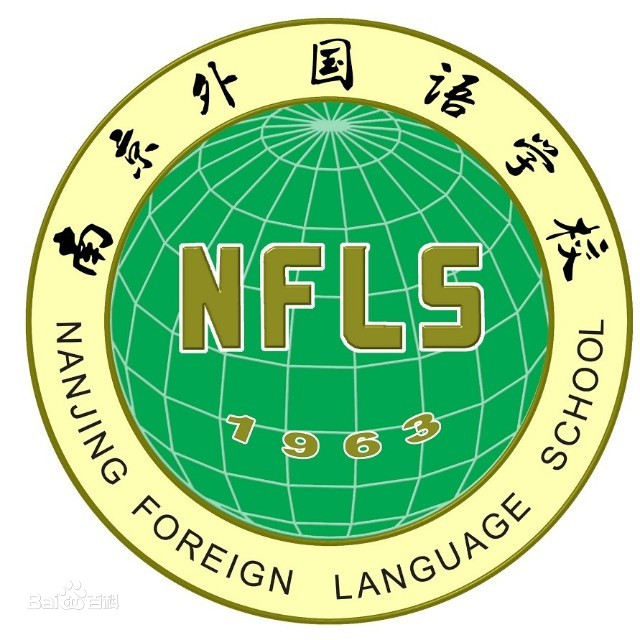

# Algorithm-Competitive-Codes

JimmyWang0417 's Algorithm Competitive Codes

蒟蒻平常做题时写的代码

各大OJ地址（按照字典序排序）：

[](http://www.51nod.com)

[](https://www.luogu.com.cn)

[](https://www.nowcoder.com)

[](http://ybt.ssoier.cn:8088)


[](https://atcoder.jp/)

[](https://www.acwing.com)

[](https://darkbzoj.cc)

[](http://265ep45199.wicp.vip)

[](http://cogs.pro:8081/cogs/)

[](https://www.codechef.com)

[](https://www.hackerrank.com)

[](https://hihocoder.com)

[](https://loj.ac)

[](http://www.nfls.com.cn:10611/)

[](https://noi.ac)

[](http://poj.org)


[Public Judge](http://pjudge.ac)

[](https://www.spoj.com)

[](https://acm.timus.ru)

[](https://www.topcoder.com)

[](https://uoj.ac)

[](https://onlinejudge.org/)

[Ybt Online Judge](https://www.ybtoj.com.cn)

[](https://zoj.pintia.cn)

[](http://zhengruioi.com)

程序的统计信息：
<!-- count the code begin -->
```plain
===============================================================================
 Language            Files        Lines         Code     Comments       Blanks
===============================================================================
 Autoconf               16      1885023      1885023            0            0
 C++                  2367       342493       333581         6215         2697
 C++ Header             14         1963         1108          568          287
 Markdown                2         2578            0         2544           34
 Python                  5          293          251            9           33
===============================================================================
 Total                2404      2232350      2219963         9336         3051
===============================================================================
```
<!-- count the code end -->

程序的目录树：
<!-- directory tree begin -->
```plain
.
├── 2019 字符串训练
│   ├── 1.哈希
│   │   ├── Campaign.cpp
│   │   ├── loop.cpp
│   │   ├── rec.cpp
│   │   ├── snow.cpp
│   │   ├── symmetry.cpp
│   │   └── ticket.cpp
│   ├── 2.kmp
│   │   ├── bzoj1009.cpp
│   │   ├── bzoj4974.cpp
│   │   ├── canon.cpp
│   │   ├── klavir.cpp
│   │   ├── match.cpp
│   │   ├── pow.cpp
│   │   ├── powerstr.cpp
│   │   ├── str.cpp
│   │   └── zoo.cpp
│   ├── 3.字典树
│   │   ├── bzoj1954.cpp
│   │   ├── HDU1247.cpp
│   │   ├── loop.cpp
│   │   ├── POJ1816.cpp
│   │   ├── poj2001.cpp
│   │   ├── secret.cpp
│   │   └── 疑惑.cpp
│   ├── 4.数位DP
│   │   ├── 奶牛编号.cpp
│   │   ├── 幸运数.cpp
│   │   ├── 幸运的666.cpp
│   │   ├── 数的变换.cpp
│   │   └── 魔法数字.cpp
│   └── 5.AC自动机
│       ├── Divljak.cpp
│       ├── tamboo.cpp
│       ├── 前缀匹配.cpp
│       ├── 单词.cpp
│       ├── 数数.cpp
│       ├── 最短字符串.cpp
│       └── 简单题.cpp
├── 51Nod
│   └── 51nod2929 部落战争.cpp
├── AcWing
│   ├── 122. 糖果传递.cpp
│   ├── 1230. K倍区间.cpp
│   ├── 125. 耍杂技的牛.cpp
│   ├── 1262. 鱼塘钓鱼.cpp
│   ├── 1402. 星空之夜.cpp
│   ├── 1414. 牛异或.cpp
│   ├── 1613. 数独简单版.cpp
│   ├── 246. 区间最大公约数.cpp
│   ├── 257. 关押罪犯.cpp
│   ├── 2823. 交换棋子.cpp
│   ├── 3028. 最小圆覆盖.cpp
│   ├── 3195. 有趣的数.cpp
│   ├── 3205. 最优配餐.cpp
│   ├── 3215. 网络延时.cpp
│   ├── 3240. 压缩编码.cpp
│   ├── 3250. 通信网络.cpp
│   ├── 479. 加分二叉树.cpp
│   ├── 499. 聪明的质监员.cpp
│   ├── 503. 借教室.cpp
│   ├── 507. 积木大赛.cpp
│   └── 730. 机器人跳跃问题.cpp
├── AtCoder
│   ├── AT1219 歴史の研究.cpp
│   ├── AT1979 [AGC001A] BBQ Easy.cpp
│   ├── AT1980 [AGC001B] Mysterious Light.cpp
│   ├── AT1981 [AGC001C] Shorten Diameter.cpp
│   ├── AT1982 [AGC001D] Arrays and Palindrome.cpp
│   ├── AT1983 [AGC001E] BBQ Hard.cpp
│   ├── AT1984 [AGC001F] Wide Swap.cpp
│   ├── AT1997 [AGC002C] Knot Puzzle.cpp
│   ├── AT1998 [AGC002D] Stamp Rally.cpp
│   ├── AT1999 [AGC002E] Candy Piles.cpp
│   ├── AT2000 [AGC002F] Leftmost Ball.cpp
│   ├── AT2002 [AGC003B] Simplified mahjong.cpp
│   ├── AT2003 [AGC003C] BBuBBBlesort!.cpp
│   ├── AT2004 [AGC003D] Anticube.cpp
│   ├── AT2005 [AGC003E] Sequential operations on Sequence.cpp
│   ├── AT2006 [AGC003F] Fraction of Fractal.cpp
│   ├── AT2043 [AGC004C] AND Grid.cpp
│   ├── AT2044 [AGC004D] Teleporter.cpp
│   ├── AT2045 [AGC004E] Salvage Robots.cpp
│   ├── AT2046 [AGC004F] Namori.cpp
│   ├── AT2060 [AGC005B] Minimum Sum.cpp
│   ├── AT2061 [AGC005C] Tree Restoring.cpp
│   ├── AT2062 [AGC005D] ~K Perm Counting.cpp
│   ├── AT2063 [AGC005E] Sugigma: The Showdown.cpp
│   ├── AT2064 [AGC005F] Many Easy Problems.cpp
│   ├── AT213 器物損壊！高橋君.cpp
│   ├── AT2141 AtCoDeer AtCoDeer and Rock-Paper.cpp
│   ├── AT2163 [AGC006B] Median Pyramid Easy.cpp
│   ├── AT2164 [AGC006C] Rabbit Exercise.cpp
│   ├── AT2165 [AGC006D] Median Pyramid Hard.cpp
│   ├── AT2166 [AGC006E] Rotate 3x3.cpp
│   ├── AT2167 [AGC006F] Blackout.cpp
│   ├── AT2169 [AGC007B] Construct Sequences.cpp
│   ├── AT2170 [AGC007C] Pushing Balls.cpp
│   ├── AT2171 [AGC007D] Shik and Game.cpp
│   ├── AT2172 [AGC007E] Shik and Travel.cpp
│   ├── AT2173 [AGC007F] Shik and Copying String.cpp
│   ├── AT2264 [AGC008B] Contiguous Repainting.cpp
│   ├── AT2265 [AGC008C] Tetromino Tiling.cpp
│   ├── AT2266 [AGC008D] K-th K.cpp
│   ├── AT2267 [AGC008E] Next or Nextnext.cpp
│   ├── AT2268 [AGC008F] Black Radius.cpp
│   ├── AT2274 [ARC066D] Contest with Drinks Hard.cpp
│   ├── AT2291 [AGC009B] Tournament.cpp
│   ├── AT2292 [AGC009C] Division into Two.cpp
│   ├── AT2293 [AGC009D] Uninity.cpp
│   ├── AT2294 [AGC009E] Eternal Average.cpp
│   ├── AT2303 [AGC010B] Boxes.cpp
│   ├── AT2339 [AGC011C] Squared Graph.cpp
│   ├── AT2340 [AGC011D] Half Reflector.cpp
│   ├── AT2341 [AGC011E] Increasing Numbers.cpp
│   ├── AT2362 [AGC012B] Splatter Painting.cpp
│   ├── AT2363 [AGC012C] Tautonym Puzzle.cpp
│   ├── AT2364 [AGC012D] Colorful Balls.cpp
│   ├── AT2365 [AGC012E] Camel and Oases.cpp
│   ├── AT2366 [AGC012F] Prefix Median.cpp
│   ├── AT2368 [AGC013B] Hamiltonish Path.cpp
│   ├── AT2369 [AGC013C] Ants on a Circle.cpp
│   ├── AT2370 [AGC013D] Piling Up.cpp
│   ├── AT2371 [AGC013E] Placing Squares.cpp
│   ├── AT2374 [AGC014B] Unplanned Queries.cpp
│   ├── AT2378 [AGC014F] Strange Sorting.cpp
│   ├── AT2379 [AGC015A] A+...+B Problem.cpp
│   ├── AT2380 [AGC015B] Evilator.cpp
│   ├── AT2381 [AGC015C] Nuske vs Phantom Thnook.cpp
│   ├── AT2382 [AGC015D] A or...or B Problem.cpp
│   ├── AT2383 [AGC015E] Mr.Aoki Incubator.cpp
│   ├── AT2384 [AGC015F] Kenus the Ancient Greek.cpp
│   ├── AT2386 [AGC016B] Colorful Hats.cpp
│   ├── AT2387 [AGC016C] +或- Rectangle.cpp
│   ├── AT2388 [AGC016D] XOR Replace.cpp
│   ├── AT2389 [AGC016E] Poor Turkeys.cpp
│   ├── AT2390 [AGC016F] Games on DAG.cpp
│   ├── AT2557 [ARC073C] Ball Coloring.cpp
│   ├── AT2665 [AGC017B] Moderate Differences.cpp
│   ├── AT2666 [AGC017C] Snuke and Spells.cpp
│   ├── AT2667 [AGC017D] Game on Tree.cpp
│   ├── AT2671 [AGC018B] Sports Festival.cpp
│   ├── AT2672 [AGC018C] Coins.cpp
│   ├── AT2673 [AGC018D] Tree and Hamilton Path.cpp
│   ├── AT2674 [AGC018E] Sightseeing Plan.cpp
│   ├── AT3635 Indifferent.cpp
│   ├── AT3857 [AGC020C] Median Sum.cpp
│   ├── AT3858 [AGC020D] Min Max Repetition.cpp
│   ├── AT3860 [AGC020F] Arcs on a Circle.cpp
│   ├── AT3870 [AGC021D] Reversed LCS.cpp
│   ├── AT3913 XOR Tree.cpp
│   ├── AT3946 [AGC022A] Diverse Word.cpp
│   ├── AT3947 [AGC022B] GCD Sequence.cpp
│   ├── AT3948 [AGC022C] Remainder Game.cpp
│   ├── AT3949 [AGC022D] Shopping.cpp
│   ├── AT3950 [AGC022E] Median Replace.cpp
│   ├── AT3952 [AGC023A] Zero-Sum Ranges.cpp
│   ├── AT3956 [AGC023E] Inversions.cpp
│   ├── AT3965 [AGC025B] RGB Coloring.cpp
│   ├── AT4168 [ARC100C] Or Plus Max.cpp
│   ├── AT4378 [AGC027D] Modulo Matrix.cpp
│   ├── AT4439 [AGC028E] High Elements.cpp
│   ├── AT4994 [AGC034D] Manhattan Max Matching.cpp
│   ├── AT5800 [AGC043C] Giant Graph.cpp
│   ├── AT_abc221_g [ABC221G] Jumping sequence.cpp
│   └── AT_abc239_h [ABC239Ex] Dice Product 2.cpp
├── BZOJ
│   ├── #1010. 玩具装箱toy.cpp
│   ├── #1269. [AHOI2006]文本编辑器editor.cpp
│   ├── #1283. 序列.cpp
│   ├── #1337. 最小圆覆盖.cpp
│   ├── #1500. [NOI2005]维修数列.cpp
│   ├── #1597. [Usaco2008 Mar]土地购买.cpp
│   ├── #1835. [ZJOI2010]base 基站选址.cpp
│   ├── #1861. [Zjoi2006]Book 书架.cpp
│   ├── #1941. [Sdoi2010]Hide and Seek.cpp
│   ├── #1977. [BeiJing2010组队]次小生成树 Tree.cpp
│   ├── #2115. [Wc2011] Xor.cpp
│   ├── #2150. 部落战争.cpp
│   ├── #2152. 聪聪可可.cpp
│   ├── #2201. 彩色圆环.cpp
│   ├── #2212. [Poi2011]Tree Rotations.cpp
│   ├── #2216. [Poi2011]Lightning Conductor.cpp
│   ├── #2223. [Coci 2009]PATULJCI.cpp
│   ├── #2318. Spoj4060 game with probability Problem.cpp
│   ├── #2342. [Shoi2011]双倍回文.cpp
│   ├── #2460. [BeiJing2011]元素.cpp
│   ├── #2527. [Poi2011]Meteors.cpp
│   ├── #2565. 最长双回文串.cpp
│   ├── #2594. [Wc2006]水管局长数据加强版.cpp
│   ├── #2626. JZPFAR.cpp
│   ├── #2639. 矩形计算.cpp
│   ├── #2648. SJY摆棋子.cpp
│   ├── #2809. [Apio2012]dispatching.cpp
│   ├── #2906. 颜色.cpp
│   ├── #2992. Pku3986 Math teacher's homework.cpp
│   ├── #3028. 食物.cpp
│   ├── #3036. 绿豆蛙的归宿.cpp
│   ├── #3065. 带插入区间K小值.cpp
│   ├── #3143. [Hnoi2013]游走.cpp
│   ├── #3159. 决战(LCT).cpp
│   ├── #3159. 决战.cpp
│   ├── #3172. [Tjoi2013]单词.cpp
│   ├── #3223. Tyvj 1729 文艺平衡树.cpp
│   ├── #3224. Tyvj 1728 普通平衡树.cpp
│   ├── #3262. 陌上花开.cpp
│   ├── #3295. [Cqoi2011]动态逆序对.cpp
│   ├── #3307. 雨天的尾巴.cpp
│   ├── #3331. [BeiJing2013]压力.cpp
│   ├── #3343. 教主的魔法.cpp
│   ├── #3450. Tyvj1952 Easy.cpp
│   ├── #3530. [Sdoi2014]数数.cpp
│   ├── #3545. [ONTAK2010]Peaks.cpp
│   ├── #3551. [ONTAK2010]Peaks加强版.cpp
│   ├── #3572. [Hnoi2014]世界树.cpp
│   ├── #3594. [Scoi2014]方伯伯的玉米田.cpp
│   ├── #3673. 可持久化并查集 by zky.cpp
│   ├── #3674. 可持久化并查集加强版.cpp
│   ├── #3687..cpp
│   ├── #3688. 折线统计.cpp
│   ├── #3757. 苹果树.cpp
│   ├── #3790. 神奇项链.cpp
│   ├── #3881. [Coci2015]Divljak.cpp
│   ├── #4003. [JLOI2015]城池攻占.cpp
│   ├── #4025. 二分图.cpp
│   ├── #4066. 简单题.cpp
│   ├── #4154. [Ipsc2015]Generating Synergy.cpp
│   ├── #4318. OSU!.cpp
│   ├── #4481. [Jsoi2015]非诚勿扰.cpp
│   ├── #4518. [Sdoi2016]征途.cpp
│   ├── #4520. [Cqoi2016]K远点对.cpp
│   ├── #4644. 经典傻逼题.cpp
│   ├── #4919. [Lydsy1706月赛]大根堆.cpp
│   ├── #4950. [Wf2017]Mission Improbable.cpp
│   └── #4974. [Lydsy1708月赛]字符串大师.cpp
├── CLOJ
│   ├── #1010. 「2021 八校联考 Day3 」蘄壺螸壚黜.cpp
│   ├── #1015. 「2021 八校联考 Day4」相似序列.cpp
│   ├── #1029. 「2021 八校联考 Day8」学校.cpp
│   ├── #1038. 「2021 八校联考 Day10」quq.cpp
│   ├── #1043. 「2021 八校联考 Day11」求和.cpp
│   ├── #1048. 「2021 八校联考 Day13」异或.cpp
│   ├── #1062. 「2021 八校联考 Day16」糖果.cpp
│   ├── #1063. 「2021 八校联考 Day16」回文.cpp
│   ├── #1064. 「2021 八校联考 Day16」平均.cpp
│   ├── #1065. 「2021 八校联考 Day16」冒泡排序.cpp
│   ├── #1072. 「2022 九校联考 Day1」爱丽丝的数位划分.cpp
│   ├── #1073. 「2022 九校联考 Day1」爱丽丝的新运算.cpp
│   ├── #1074. 「2022 九校联考 Day1」爱丽丝的幻方.cpp
│   ├── #1075. 「2022 九校联考 Day1」爱丽丝斗恶龙.cpp
│   ├── #1076. 「2022 九校联考 Day2」Convolutional Neural Network.cpp
│   ├── #1077. 「2022 九校联考 Day2」after two months.cpp
│   ├── #1078. 「2022 九校联考 Day2」escape from whk.cpp
│   ├── #1080. 「2022 九校联考 Day3」题目.cpp
│   ├── #1081. 「2022 九校联考 Day3」名字.cpp
│   ├── #1082. 「2022 九校联考 Day3」好难.cpp
│   ├── #1083. 「2022 九校联考 Day3」取啊.cpp
│   ├── #1084. 「2022 九校联考 Day4」棋子分组.cpp
│   ├── #1085. 「2022 九校联考 Day4」信息传输.cpp
│   ├── #1086. 「2022 九校联考 Day4」双栈排序.cpp
│   ├── #1087. 「2022 九校联考 Day4」模糊匹配.cpp
│   ├── #1088. 「2022 九校联考 Day5」不降序列.cpp
│   ├── #1089. 「2022 九校联考 Day5」分组问题.cpp
│   ├── #1090. 「2022 九校联考 Day5」变换问题.cpp
│   └── #1091. 「2022 九校联考 Day5」第四道题.cpp
├── CmYkRgB123 Online Grading System
│   ├── 2479. [HZOI 2016] 偏序.cpp
│   ├── 2639. [HZOI 2015] 偏序++.cpp
│   └── 2701. 动态树.cpp
├── CodeChef
│   ├── AMR14F Jersey Number.cpp
│   ├── BEAUTY Beautiful Sandwich.cpp
│   ├── CCC Hit the Coconuts.cpp
│   ├── CF1304F1 Animal Observation (easy version).cpp
│   ├── COVERING Covering Sets.cpp
│   ├── FNCS Chef and Churu.cpp
│   └── STR_FUNC Strange Functions.cpp
├── Codeforces
│   ├── Group
│   │   └── 1st Hunger Games
│   │       ├── K. Pepsi Cola.cpp
│   │       └── README.md
│   ├── GYM
│   │   ├── 2005-2006 Winter Petrozavodsk Camp, Andrew Stankevich Contest 16 (ASC 16)
│   │   │   └── F. Pipe Layout.cpp
│   │   ├── 2017-2018 ACM-ICPC Southeastern European Regional Programming Contest (SEERC 2017)
│   │   │   └── B. Bricks.cpp
│   │   ├── 2018-2019 Summer Petrozavodsk Camp, Oleksandr Kulkov Contest 2
│   │   │   └── B. Yet Another Convolution.cpp
│   │   ├── 2021-2022 ICPC Northwestern European Regional Programming Contest (NWERC 2021)
│   │   │   ├── G - Glossary Arrangement.cpp
│   │   │   └── H - Heating Up.cpp
│   │   ├── 2022 China Collegiate Programming Contest (CCPC) Guangzhou Onsite
│   │   │   └── F. Equations.cpp
│   │   ├── 2022 China Collegiate Programming Contest (CCPC) Guilin Site
│   │   │   ├── I. Invincible Hotwheels.cpp
│   │   │   └── K. Barrel Theory.cpp
│   │   ├── 2022 China Collegiate Programming Contest (CCPC) Weihai Site
│   │   │   ├── B. Recruitment.cpp
│   │   │   └── M - String Master.cpp
│   │   ├── 2022 Hubei Provincial Collegiate Programming Contest
│   │   │   ├── B. Potion(easy version).cpp
│   │   │   ├── C - Potion(hard version).cpp
│   │   │   ├── G. Brick.cpp
│   │   │   └── J - Palindrome Reversion.cpp
│   │   ├── 2022 Shanghai Collegiate Programming Contest
│   │   │   ├── D. Demonstrational sequences.cpp
│   │   │   └── F - Forest of Magic.cpp
│   │   ├── 2022 Taiwan NHSPC Mock Contest
│   │   │   ├── C. 頒獎音樂 (Ceremony).cpp
│   │   │   └── I. 子集合和 (SOS).cpp
│   │   ├── China Collegiate Programming Contest 2021, Qualification Round (Online), Rematch
│   │   │   ├── B - Kanade Doesn't Want to Learn CG.cpp
│   │   │   ├── C - GCD on Tree.cpp
│   │   │   ├── D - Primality Test.cpp
│   │   │   ├── E - Monopoly.cpp
│   │   │   ├── F - Nun Heh Heh Aaaaaaaaaaa.cpp
│   │   │   ├── H - Subpermutation.cpp
│   │   │   ├── J - Bigraph Extension.cpp
│   │   │   └── K - Jumping Monkey.cpp
│   │   ├── OCPC 2023, Oleksandr Kulkov Contest 3
│   │   │   └── F. Palindromic Polynomial.cpp
│   │   ├── The 17th Heilongjiang Provincial Collegiate Programming Contest
│   │   │   ├── B - Lovely Fish.cpp
│   │   │   └── J - JOJO's Happy Tree Friends.cpp
│   │   ├── The 19th Zhejiang Provincial Collegiate Programming Contest
│   │   │   ├── E - Easy Jump.cpp
│   │   │   └── H - A=B.cpp
│   │   ├── The 2022 ICPC Asia Shenyang Regional Contest (The 1st Universal Cup, Stage 1: Shenyang)
│   │   │   └── M - Vulpecula.cpp
│   │   ├── The 2023 ICPC Asia Hong Kong Regional Programming Contest (The 1st Universal Cup, Stage 2:Hong Kong)
│   │   │   ├── D - Shortest Path Query.cpp
│   │   │   ├── I - Range Closest Pair of Points Query.cpp
│   │   │   ├── J - Dice Game.cpp
│   │   │   └── K. Maximum GCD.cpp
│   │   └── The 7th China Collegiate Programming Contest, Finals (CCPC Finals 2021)
│   │       ├── D - Tree Partition.cpp
│   │       └── E - Elegant Tetris.cpp
│   └── PROBLEMSET
│       ├── CF1000F One Occurrence.cpp
│       ├── CF1007D Ants.cpp
│       ├── CF1009F Dominant Indices.cpp
│       ├── CF1017G The Tree.cpp
│       ├── CF1019D Large Triangle.cpp
│       ├── CF1025D Recovering BST.cpp
│       ├── CF1027F Session in BSU.cpp
│       ├── CF1034A Enlarge GCD.cpp
│       ├── CF1036F Relatively Prime Powers.cpp
│       ├── CF1037H Security.cpp
│       ├── CF1039D You Are Given a Tree.cpp
│       ├── CF1042E Vasya and Magic Matrix.cpp
│       ├── CF1051F The Shortest Statement.cpp
│       ├── CF1060F Shrinking Tree.cpp
│       ├── CF1063F String Journey.cpp
│       ├── CF1067D Computer Game.cpp
│       ├── CF1070F Debate.cpp
│       ├── CF1073E Segment Sum.cpp
│       ├── CF1073G Yet Another LCP Problem.cpp
│       ├── CF1077D Cutting Out.cpp
│       ├── CF1080C Masha and two friends.cpp
│       ├── CF1080F Katya and Segments Sets.cpp
│       ├── CF1082G Petya and Graph.cpp
│       ├── CF1083E The Fair Nut and Rectangles.cpp
│       ├── CF1093E Intersection of Permutations.cpp
│       ├── CF1093F Vasya and Array.cpp
│       ├── CF1093G Multidimensional Queries.cpp
│       ├── CF1097F Alex and a TV Show.cpp
│       ├── CF1097G Vladislav and a Great Legend.cpp
│       ├── CF1100F Ivan and Burgers.cpp
│       ├── CF1103D Professional layer.cpp
│       ├── CF1103E Radix sum.cpp
│       ├── CF1109E Sasha and a Very Easy Test.cpp
│       ├── CF1110F Nearest Leaf.cpp
│       ├── CF1111C Creative Snap.cpp
│       ├── CF1114E Arithmetic Progression.cpp
│       ├── CF1114F Please, another Queries on Array?.cpp
│       ├── CF1119F Niyaz and Small Degrees.cpp
│       ├── CF1119H Triple.cpp
│       ├── CF1120D Power Tree.cpp
│       ├── CF1131D Gourmet choice.cpp
│       ├── CF1131E String Multiplication.cpp
│       ├── CF1131F Asya And Kittens.cpp
│       ├── CF1132G Greedy Subsequences.cpp
│       ├── CF1139D Steps to One.cpp
│       ├── CF1139E Maximize Mex.cpp
│       ├── CF1144G Two Merged Sequences.cpp
│       ├── CF1147C Thanos Nim.cpp
│       ├── CF1149C Tree Generator™.cpp
│       ├── CF1151F Sonya and Informatics.cpp
│       ├── CF1152C Neko does Maths.cpp
│       ├── CF1153D Serval and Rooted Tree.cpp
│       ├── CF1158F Density of subarrays.cpp
│       ├── CF1172E Nauuo and ODT.cpp
│       ├── CF1174E Ehab and the Expected GCD Problem.cpp
│       ├── CF1175G Yet Another Partiton Problem.cpp
│       ├── CF1178G The Awesomest Vertex.cpp
│       ├── CF1188C Array Beauty.cpp
│       ├── CF1188D Make Equal.cpp
│       ├── CF1202E You Are Given Some Strings.cpp
│       ├── CF1208F Bits And Pieces.cpp
│       ├── CF1208G Polygons.cpp
│       ├── CF1209E1 Rotate Columns (easy version).cpp
│       ├── CF1209E2 Rotate Columns (hard version).cpp
│       ├── CF1209F Koala and Notebook.cpp
│       ├── CF120J Minimum Sum.cpp
│       ├── CF1225G To Make 1.cpp
│       ├── CF1227F1 Wrong Answer on test 233 (Easy Version).cpp
│       ├── CF1227F2 Wrong Answer on test 233 (Hard Version).cpp
│       ├── CF1228E Another Filling the Grid.cpp
│       ├── CF1237F Balanced Domino Placements.cpp
│       ├── CF1239D Catowice City.cpp
│       ├── CF123E Maze.cpp
│       ├── CF1244G Running in Pairs.cpp
│       ├── CF1251E1 Voting (Easy Version).cpp
│       ├── CF1251E2 Voting (Hard Version).cpp
│       ├── CF1253F Cheap Robot.cpp
│       ├── CF1254D Tree Queries.cpp
│       ├── CF1264D1 Beautiful Bracket Sequence (easy version).cpp
│       ├── CF1264D2 Beautiful Bracket Sequence (hard version).cpp
│       ├── CF1270F Awesome Substrings.cpp
│       ├── CF1270G Subset with Zero Sum.cpp
│       ├── CF1278F Cards.cpp
│       ├── CF1279A New Year Garland.cpp
│       ├── CF1279B Verse For Santa.cpp
│       ├── CF1285F Classical?.cpp
│       ├── CF1290C Prefix Enlightenment.cpp
│       ├── CF1295A Display The Number.cpp
│       ├── CF1295B Infinite Prefixes.cpp
│       ├── CF1295C Obtain The String.cpp
│       ├── CF1295D Same GCDs.cpp
│       ├── CF1295E Permutation Separation.cpp
│       ├── CF1301A Three Strings.cpp
│       ├── CF1301B Motarack's Birthday.cpp
│       ├── CF1301C Ayoub's function.cpp
│       ├── CF1304A Two Rabbits.cpp
│       ├── CF1304B Longest Palindrome.cpp
│       ├── CF1304C Air Conditioner.cpp
│       ├── CF1304E 1-Trees and Queries.cpp
│       ├── CF1304F2 Animal Observation (hard version).cpp
│       ├── CF1305A Kuroni and the Gifts.cpp
│       ├── CF1305B Kuroni and Simple Strings.cpp
│       ├── CF1305C Kuroni and Impossible Calculation.cpp
│       ├── CF1305D Kuroni and the Celebration.cpp
│       ├── CF1311A Add Odd or Subtract Even.cpp
│       ├── CF1311B WeirdSort.cpp
│       ├── CF1311C Perform the Combo.cpp
│       ├── CF1311D Three Integers.cpp
│       ├── CF1311E Construct the Binary Tree.cpp
│       ├── CF1311F Moving Points.cpp
│       ├── CF1312A Two Regular Polygons.cpp
│       ├── CF1312B Bogosort.cpp
│       ├── CF1312C Adding Powers.cpp
│       ├── CF1312D Count the Arrays.cpp
│       ├── CF1312E Array Shrinking.cpp
│       ├── CF1313A Fast Food Restaurant.cpp
│       ├── CF1313B Different Rules.cpp
│       ├── CF1313C1 Skyscrapers (easy version).cpp
│       ├── CF1313C2 Skyscrapers (hard version).cpp
│       ├── CF1316A Grade Allocation.cpp
│       ├── CF1316B String Modification.cpp
│       ├── CF1316C Primitive Primes.cpp
│       ├── CF1316D Nash Matrix.cpp
│       ├── CF1320A Journey Planning.cpp
│       ├── CF1320B Navigation System.cpp
│       ├── CF1320D Reachable Strings.cpp
│       ├── CF1321A Contest for Robots.cpp
│       ├── CF1321C Remove Adjacent.cpp
│       ├── CF1324A Yet Another Tetris Problem.cpp
│       ├── CF1324B Yet Another Palindrome Problem.cpp
│       ├── CF1324C Frog Jumps.cpp
│       ├── CF1324D Pair of Topics.cpp
│       ├── CF1324E Sleeping Schedule.cpp
│       ├── CF1324F Maximum White Subtree.cpp
│       ├── CF1325A EhAb AnD gCd.cpp
│       ├── CF1325B CopyCopyCopyCopyCopy.cpp
│       ├── CF1325C Ehab and Path-etic MEXs.cpp
│       ├── CF1325D Ehab the Xorcist.cpp
│       ├── CF1325F Ehab's Last Theorem.cpp
│       ├── CF1326E Bombs.cpp
│       ├── CF1327F AND Segments.cpp
│       ├── CF1344C Quantifier Question.cpp
│       ├── CF1348E Phoenix and Berries.cpp
│       ├── CF1361C Johnny and Megan's Necklace.cpp
│       ├── CF1363F Rotating Substrings.cpp
│       ├── CF1367F1 Flying Sort (Easy Version).cpp
│       ├── CF1367F2 Flying Sort (Hard Version).cpp
│       ├── CF1368H1 Breadboard Capacity (easy version).cpp
│       ├── CF1369E DeadLee.cpp
│       ├── CF1372E Omkar and Last Floor.cpp
│       ├── CF1375E Inversion SwapSort.cpp
│       ├── CF1392F Omkar and Landslide.cpp
│       ├── CF1394C Boboniu and String.cpp
│       ├── CF13E Holes.cpp
│       ├── CF1401F Reverse and Swap.cpp
│       ├── CF1408E Avoid Rainbow Cycles.cpp
│       ├── CF1416D Graph and Queries.cpp
│       ├── CF1418E Expected Damage.cpp
│       ├── CF1428F Fruit Sequences.cpp
│       ├── CF1436E Complicated Computations.cpp
│       ├── CF1437F Emotional Fishermen.cpp
│       ├── CF1438E Yurii Can Do Everything.cpp
│       ├── CF1439C Greedy Shopping.cpp
│       ├── CF1439D INOI Final Contests.cpp
│       ├── CF1442D Sum.cpp
│       ├── CF1442E Black, White and Grey Tree.cpp
│       ├── CF1444C Team-Building.cpp
│       ├── CF1446D1 Frequency Problem (Easy Version).cpp
│       ├── CF1446D2 Frequency Problem (Hard Version).cpp
│       ├── CF1450G Communism.cpp
│       ├── CF1452E Two Editorials.cpp
│       ├── CF1458C Latin Square.cpp
│       ├── CF1463F Max Correct Set.cpp
│       ├── CF1466G Song of the Sirens.cpp
│       ├── CF1467E Distinctive Roots in a Tree.cpp
│       ├── CF1473E Minimum Path.cpp
│       ├── CF1474F 1 2 3 4 ... .cpp
│       ├── CF1476F Lanterns.cpp
│       ├── CF147B Smile House.cpp
│       ├── CF1481E Sorting Books.cpp
│       ├── CF1485F Copy or Prefix Sum.cpp
│       ├── CF148D Bag of mice.cpp
│       ├── CF1494E A-Z Graph.cpp
│       ├── CF1495D BFS Trees.cpp
│       ├── CF1497E1 Square-free division (easy version).cpp
│       ├── CF1497E2 Square-free division (hard version).cpp
│       ├── CF1499E Chaotic Merge.cpp
│       ├── CF1517F Reunion.cpp
│       ├── CF1523E Crypto Lights.cpp
│       ├── CF1527D MEX Tree.cpp
│       ├── CF1527E Partition Game.cpp
│       ├── CF1550E Stringforces.cpp
│       ├── CF1553G Common Divisor Graph.cpp
│       ├── CF1554E You.cpp
│       ├── CF1559D1 Mocha and Diana (Easy Version).cpp
│       ├── CF1559D2 Mocha and Diana (Hard Version).cpp
│       ├── CF1562E Rescue Niwen!.cpp
│       ├── CF156D Clues.cpp
│       ├── CF1588F Jumping Through the Array.cpp
│       ├── CF1592E Bored Bakry.cpp
│       ├── CF15D Map.cpp
│       ├── CF1606F Tree Queries.cpp
│       ├── CF1608F MEX counting.cpp
│       ├── CF1610G AmShZ Wins a Bet.cpp
│       ├── CF161D Distance in Tree.cpp
│       ├── CF1634F Fibonacci Additions.cpp
│       ├── CF163E e-Government.cpp
│       ├── CF1641D Two Arrays.cpp
│       ├── CF165E Compatible Numbers.cpp
│       ├── CF17C Balance.cpp
│       ├── CF17E Palisection.cpp
│       ├── CF19D Points.cpp
│       ├── CF19E Fairy.cpp
│       ├── CF204E Little Elephant and Strings.cpp
│       ├── CF208E Blood Cousins.cpp
│       ├── CF220E Little Elephant and Inversions.cpp
│       ├── CF232E Quick Tortoise.cpp
│       ├── CF235B Let's Play Osu!.cpp
│       ├── CF235C Cyclical Quest.cpp
│       ├── CF23C Oranges and Apples.cpp
│       ├── CF23E Tree.cpp
│       ├── CF240F TorCoder.cpp
│       ├── CF246E Blood Cousins Return.cpp
│       ├── CF248E Piglet's Birthday.cpp
│       ├── CF24D Broken robot.cpp
│       ├── CF258D Little Elephant and Broken Sorting.cpp
│       ├── CF260E Dividing Kingdom.cpp
│       ├── CF261B Maxim and Restaurant.cpp
│       ├── CF277E Binary Tree on Plane.cpp
│       ├── CF280C Game on Tree.cpp
│       ├── CF280D k-Maximum Subsequence Sum.cpp
│       ├── CF284A Cows and Primitive Roots.cpp
│       ├── CF286E Ladies' Shop.cpp
│       ├── CF293E Close Vertices.cpp
│       ├── CF311B Cats Transport.cpp
│       ├── CF315A Sereja and Bottles.cpp
│       ├── CF323C Two permutations.cpp
│       ├── CF327E Axis Walking.cpp
│       ├── CF337D Book of Evil.cpp
│       ├── CF338D GCD Table.cpp
│       ├── CF338E Optimize!.cpp
│       ├── CF340E Iahub and Permutations.cpp
│       ├── CF341D Iahub and Xors.cpp
│       ├── CF342E Xenia and Tree.cpp
│       ├── CF343D Water Tree.cpp
│       ├── CF348C Subset Sums.cpp
│       ├── CF351D Jeff and Removing Periods.cpp
│       ├── CF375D Tree and Queries.cpp
│       ├── CF379F New Year Tree.cpp
│       ├── CF383C Propagating tree.cpp
│       ├── CF383E Vowels.cpp
│       ├── CF398B Painting The Wall.cpp
│       ├── CF40E Number Table.cpp
│       ├── CF413D 2048.cpp
│       ├── CF416E President's Path.cpp
│       ├── CF427D Match & Catch.cpp
│       ├── CF436E Cardboard Box.cpp
│       ├── CF442D Adam and Tree.cpp
│       ├── CF444C DZY Loves Colors.cpp
│       ├── CF446C DZY Loves Fibonacci Numbers.cpp
│       ├── CF449C Jzzhu and Apples.cpp
│       ├── CF449D Jzzhu and Numbers.cpp
│       ├── CF44G Shooting Gallery.cpp
│       ├── CF452E Three strings.cpp
│       ├── CF452F Permutation.cpp
│       ├── CF453A Little Pony and Expected Maximum.cpp
│       ├── CF455D Serega and Fun.cpp
│       ├── CF45F Goats and Wolves.cpp
│       ├── CF464E The Classic Problem.cpp
│       ├── CF468B Two Sets.cpp
│       ├── CF468E Permanent.cpp
│       ├── CF484D Kindergarten.cpp
│       ├── CF484E Sign on Fence.cpp
│       ├── CF487D Conveyor Belts.cpp
│       ├── CF487E Tourists.cpp
│       ├── CF498B Name That Tune.cpp
│       ├── CF505E Mr. Kitayuta vs. Bamboos.cpp
│       ├── CF506D Mr. Kitayuta's Colorful Graph.cpp
│       ├── CF506E Mr. Kitayuta's Gift.cpp
│       ├── CF510E Fox And Dinner.cpp
│       ├── CF516D Drazil and Morning Exercise.cpp
│       ├── CF518D Ilya and Escalator.cpp
│       ├── CF519E A and B and Lecture Rooms.cpp
│       ├── CF521D Shop.cpp
│       ├── CF526F Pudding Monsters.cpp
│       ├── CF527E Data Center Drama.cpp
│       ├── CF528D Fuzzy Search.cpp
│       ├── CF53E Dead Ends.cpp
│       ├── CF543C Remembering Strings.cpp
│       ├── CF547A Mike and Frog.cpp
│       ├── CF547E Mike and Friends.cpp
│       ├── CF551E GukiZ and GukiZiana.cpp
│       ├── CF555E Case of Computer Network.cpp
│       ├── CF558E A Simple Task.cpp
│       ├── CF559E Gerald and Path.cpp
│       ├── CF55D Beautiful numbers.cpp
│       ├── CF55E Very simple problem.cpp
│       ├── CF570D Tree Requests.cpp
│       ├── CF573D Bear and Cavalry.cpp
│       ├── CF573E Bear and Bowling.cpp
│       ├── CF576D Flights for Regular Customers.cpp
│       ├── CF576E Painting Edges.cpp
│       ├── CF57D Journey.cpp
│       ├── CF580E Kefa and Watch.cpp
│       ├── CF581F Zublicanes and Mumocrates.cpp
│       ├── CF585E Present for Vitalik the Philatelist.cpp
│       ├── CF594D REQ.cpp
│       ├── CF5E Bindian Signalizing.cpp
│       ├── CF600E Lomsat gelral.cpp
│       ├── CF603E Pastoral Oddities.cpp
│       ├── CF605E Intergalaxy Trips.cpp
│       ├── CF607B Zuma.cpp
│       ├── CF60D Savior.cpp
│       ├── CF610A Pasha and Stick.cpp
│       ├── CF613D Kingdom and its Cities.cpp
│       ├── CF617E XOR and Favorite Number.cpp
│       ├── CF622F The Sum of the k-th Powers.cpp
│       ├── CF626E Simple Skewness.cpp
│       ├── CF626F Group Projects.cpp
│       ├── CF628D Magic Numbers.cpp
│       ├── CF630C Lucky Numbers.cpp
│       ├── CF631E Product Sum.cpp
│       ├── CF632E Thief in a Shop.cpp
│       ├── CF643C Levels and Regions.cpp
│       ├── CF650D Zip-line.cpp
│       ├── CF653F Paper task.cpp
│       ├── CF660F Bear and Bowling 4.cpp
│       ├── CF662C Binary Table.cpp
│       ├── CF666E Forensic Examination.cpp
│       ├── CF671D Roads in Yusland.cpp
│       ├── CF68D Half-decay tree.cpp
│       ├── CF698C LRU.cpp
│       ├── CF708C Centroids.cpp
│       ├── CF708E Student's Camp.cpp
│       ├── CF710F String Set Queries.cpp
│       ├── CF713D Animals and Puzzle.cpp
│       ├── CF715C Digit Tree.cpp
│       ├── CF724E Goods transportation.cpp
│       ├── CF724G Xor-matic Number of the Graph.cpp
│       ├── CF734F Anton and School.cpp
│       ├── CF739C Alyona and towers.cpp
│       ├── CF739E Gosha is hunting.cpp
│       ├── CF741D Arpa’s letter-marked tree and Mehrdad’s Dokhtar-kosh paths.cpp
│       ├── CF749E Inversions After Shuffle.cpp
│       ├── CF750E New Year and Old Subsequence.cpp
│       ├── CF757F Team Rocket Rises Again.cpp
│       ├── CF765F Souvenirs.cpp
│       ├── CF771D Bear and Company.cpp
│       ├── CF771E Bear and Rectangle Strips.cpp
│       ├── CF785E Anton and Permutation.cpp
│       ├── CF786C Till I Collapse.cpp
│       ├── CF798D Mike and distribution.cpp
│       ├── CF79D Password.cpp
│       ├── CF800D Varying Kibibits.cpp
│       ├── CF802A Heidi and Library (easy).cpp
│       ├── CF802C Heidi and Library (hard).cpp
│       ├── CF802I Fake News (hard).cpp
│       ├── CF804D Expected diameter of a tree.cpp
│       ├── CF811E Vladik and Entertaining Flags.cpp
│       ├── CF813D Two Melodies.cpp
│       ├── CF815C Karen and Supermarket.cpp
│       ├── CF827D Best Edge Weight.cpp
│       ├── CF830D Singer House.cpp
│       ├── CF835F Roads in the Kingdom.cpp
│       ├── CF839D Winter is here.cpp
│       ├── CF840C On the Bench.cpp
│       ├── CF840D Destiny.cpp
│       ├── CF848C Goodbye Souvenir.cpp
│       ├── CF848E Days of Floral Colours.cpp
│       ├── CF855E Salazar Slytherin's Locket.cpp
│       ├── CF869C The Intriguing Obsession.cpp
│       ├── CF869E The Untended Antiquity.cpp
│       ├── CF86C Genetic engineering.cpp
│       ├── CF873F Forbidden Indices.cpp
│       ├── CF875F Royal Questions.cpp
│       ├── CF888G Xor-MST.cpp
│       ├── CF891E Lust.cpp
│       ├── CF893F Subtree Minimum Query.cpp
│       ├── CF896C Willem, Chtholly and Seniorious.cpp
│       ├── CF896E Welcome home, Chtholly.cpp
│       ├── CF898F Restoring the Expression.cpp
│       ├── CF906D Power Tower.cpp
│       ├── CF908D New Year and Arbitrary Arrangement.cpp
│       ├── CF908G New Year and Original Order.cpp
│       ├── CF911G Mass Change Queries.cpp
│       ├── CF912E Prime Gift.cpp
│       ├── CF914D Bash and a Tough Math Puzzle.cpp
│       ├── CF914E Palindromes in a Tree.cpp
│       ├── CF914F Substrings in a String.cpp
│       ├── CF915E Physical Education Lessons.cpp
│       ├── CF915F Imbalance Value of a Tree.cpp
│       ├── CF923C Perfect Security.cpp
│       ├── CF932E Team Work.cpp
│       ├── CF932F Escape Through Leaf.cpp
│       ├── CF93C Azembler.cpp
│       ├── CF93D Flags.cpp
│       ├── CF940E Cashback.cpp
│       ├── CF940F Machine Learning.cpp
│       ├── CF954I Yet Another String Matching Problem.cpp
│       ├── CF959F Mahmoud and Ehab and yet another xor task.cpp
│       ├── CF95D Horse Races.cpp
│       ├── CF95E Lucky Country.cpp
│       ├── CF960G Bandit Blues.cpp
│       ├── CF961G Partitions.cpp
│       ├── CF963D Frequency of String.cpp
│       ├── CF985G Team Players.cpp
│       ├── CF986C AND Graph.cpp
│       ├── CF995F Cowmpany Cowmpensation.cpp
│       ├── CF997C Sky Full of Stars.cpp
│       └── CF997E Good Subsegments.cpp
├── custom_code_generator.py
├── Generator.py
├── HackerRank
│   ├── Subset
│   │   ├── 1.in
│   │   ├── 1.out
│   │   ├── 10.in
│   │   ├── 10.out
│   │   ├── 11.in
│   │   ├── 11.out
│   │   ├── 12.in
│   │   ├── 12.out
│   │   ├── 13.in
│   │   ├── 13.out
│   │   ├── 14.in
│   │   ├── 14.out
│   │   ├── 15.in
│   │   ├── 15.out
│   │   ├── 2.in
│   │   ├── 2.out
│   │   ├── 3.in
│   │   ├── 3.out
│   │   ├── 4.in
│   │   ├── 4.out
│   │   ├── 5.in
│   │   ├── 5.out
│   │   ├── 6.in
│   │   ├── 6.out
│   │   ├── 7.in
│   │   ├── 7.out
│   │   ├── 8.in
│   │   ├── 8.out
│   │   ├── 9.in
│   │   ├── 9.out
│   │   ├── sample.in
│   │   └── sample.out
│   └── Subset.cpp
├── Hangzhou Dianzi University Online Judge
│   ├── hdu1007 Quoit Design.cpp
│   ├── hdu1400 Mondriaan's Dream.cpp
│   ├── hdu1542 Atlantis.cpp
│   ├── hdu1693 Eat the Trees.cpp
│   ├── hdu1828 Picture.cpp
│   ├── hdu2068 RPG的错排.cpp
│   ├── hdu3062 Party.cpp
│   ├── hdu3507 Print Article.cpp
│   ├── hdu3693 Math teacher's homework.cpp
│   ├── hdu3949 XOR.cpp
│   ├── hdu4336 Card Collector.cpp
│   ├── hdu4819 Mosaic.cpp
│   ├── hdu4991 Ordered Subsequence(zkw线段树).cpp
│   ├── hdu4991 Ordered Subsequence(树状数组).cpp
│   ├── hdu5157 Harry and magic string.cpp
│   ├── hdu6157 The Karting.cpp
│   └── hdu6566 The Hanged Man.cpp
├── hihoCoder
│   └── 1602 本质不同的回文子串的数量.cpp
├── Libre Online Judge
│   ├── #10047「一本通 2.2 练习 3」似乎在梦中见过的样子.cpp
│   ├── #10062.cpp
│   ├── #10063.cpp
│   ├── #10097.cpp
│   ├── #10100.cpp
│   ├── #10102.cpp
│   ├── #10114.cpp
│   ├── #10115.cpp
│   ├── #10116.cpp
│   ├── #10117.cpp
│   ├── #10118.cpp
│   ├── #10119.cpp
│   ├── #10120.cpp
│   ├── #10121.cpp
│   ├── #10122.cpp
│   ├── #10123.cpp
│   ├── #10125.cpp
│   ├── #10126.cpp
│   ├── #10127.cpp
│   ├── #10128.cpp
│   ├── #10129.cpp
│   ├── #10130.cpp
│   ├── #10131.cpp
│   ├── #10132.cpp
│   ├── #10134.cpp
│   ├── #10135.cpp
│   ├── #10136.cpp
│   ├── #10154.cpp
│   ├── #10156.cpp
│   ├── #10157.cpp
│   ├── #10160.cpp
│   ├── #10163.cpp
│   ├── #10164.cpp
│   ├── #10165.cpp
│   ├── #10170.cpp
│   ├── #10176.cpp
│   ├── #10178.cpp
│   ├── #10193.cpp
│   ├── #10194.cpp
│   ├── #10195.cpp
│   ├── #10196.cpp
│   ├── #10197.cpp
│   ├── #10198.cpp
│   ├── #10199.cpp
│   ├── #10200.cpp
│   ├── #10201.cpp
│   ├── #10202.cpp
│   ├── #10203.cpp
│   ├── #10205.cpp
│   ├── #10206.cpp
│   ├── #10209.cpp
│   ├── #10211.cpp
│   ├── #10212.cpp
│   ├── #10213.cpp
│   ├── #10214.cpp
│   ├── #10215.cpp
│   ├── #10216.cpp
│   ├── #10217.cpp
│   ├── #10218.cpp
│   ├── #10219.cpp
│   ├── #10220.cpp
│   ├── #10221.cpp
│   ├── #10222.cpp
│   ├── #10223.cpp
│   ├── #10225.cpp
│   ├── #10243 「一本通 6.7 例 3」移棋子游戏.cpp
│   ├── #10244 「一本通 6.7 练习 1」取石子游戏.cpp
│   ├── #10245 「一本通 6.7 练习 2」巧克力棒.cpp
│   ├── #10247 「一本通 6.7 练习 4」S-Nim.cpp
│   ├── #115 无源汇有上下界可行流.cpp
│   ├── #116 有源汇有上下界最大流.cpp
│   ├── #117 有源汇有上下界最小流.cpp
│   ├── #130.cpp
│   ├── #134 二维树状数组 2：区间修改，单点查询.cpp
│   ├── #135 二维树状数组 3：区间修改，区间查询.cpp
│   ├── #2589.cpp
│   ├── #2597.cpp
│   ├── #2605.cpp
│   ├── #2720 「NOI2018」你的名字.cpp
│   ├── #3156 「NOI2019」回家路线.cpp
│   ├── #3159. 「NOI2019」弹跳.cpp
│   ├── #3277. 「JOISC 2020 Day3」星座 3.cpp
│   ├── #3408. 「2020-2021 集训队作业」lancllords.cpp
│   ├── #494. 「斜率优化 DP」最小划分.cpp
│   ├── #508. 「LibreOJ NOI Round #1」失控的未来交通工具.cpp
│   ├── #6001 「网络流 24 题」太空飞行计划.cpp
│   ├── #6030. 「雅礼集训 2017 Day1」矩阵.cpp
│   ├── #6192 「美团 CodeM 复赛」城市网络.cpp
│   ├── #6198 谢特.cpp
│   ├── #6277 数列分块入门 1.cpp
│   ├── #6278 数列分块入门 2.cpp
│   ├── #6279 数列分块入门 3.cpp
│   ├── #6280 数列分块入门 4.cpp
│   ├── #6281 数列分块入门 5.cpp
│   ├── #6282 数列分块入门 6.cpp
│   ├── #6283 数列分块入门 7.cpp
│   ├── #6284 数列分块入门 8.cpp
│   ├── #6285 数列分块入门 9.cpp
│   ├── #6406. 「ICPC World Finals 2018」绿宝石之岛.cpp
│   ├── #6485. LJJ 学二项式定理.cpp
│   ├── #6490. 「XXOI 2018」暑假时在做什么？有没有空？可以来学物理吗？.cpp
│   ├── #6669 Nauuo and Binary Tree.cpp
│   └── #P5330 [SNOI2019]数论.cpp
├── Nanjing Foreign Language School Online Judge
│   ├── #10060. 服务器需求.cpp
│   ├── #10241. 式神.cpp
│   ├── #1153. 异或.cpp
│   ├── #1154. 「2021六校联考WC #2」三角形.cpp
│   ├── #1184. 「2021六校联考WC #12」人造感情.cpp
│   ├── #12377. 送人匕首.cpp
│   ├── #13414. 「20230218」基础逆序对练习题.cpp
│   ├── #13415. 「20230218」基础全排列练习题.cpp
│   ├── #13416. 「20230218」化纤.cpp
│   ├── #13417. 「20230218」拍劣.cpp
│   ├── #13419. 「20230224」笑脸和三个爱心.cpp
│   ├── #13420. 「20230224」好吃.cpp
│   ├── #13421. 「20230224」抱抱.cpp
│   ├── #13422. 「20230227」最大公约数.cpp
│   ├── #13423. 「20230227」最短路.cpp
│   ├── #13424. 「20230227」投骰子.cpp
│   ├── #13425. 「20230227」平面最近点对.cpp
│   ├── #13426. 「20230221」代码旅行.cpp
│   ├── #13427. 「20230221」奶牛旅行.cpp
│   ├── #13428. 「20230221」图上旅行.cpp
│   ├── #13429. 「20230221」序列旅行.cpp
│   ├── #13430. 「20230222」DJ 数数.cpp
│   ├── #13431. 「20230222」丁真马马.cpp
│   ├── #13432. 「20230222」说藏话了.cpp
│   ├── #13434. 「20230223」大回文.cpp
│   ├── #13435. 「20230223」大马.cpp
│   ├── #13436. 「20230223」大枝江.cpp
│   ├── #13438. 「20230225」时间旅行.cpp
│   ├── #13439. 「20230225」节点旅行.cpp
│   ├── #13440. 「20230225」结束旅行.cpp
│   ├── #13442. 「20230228」小 G 的 cmd.cpp
│   ├── #13443. 「20230228」小 H 的谜题.cpp
│   ├── #13445. 「20230301」Card.cpp
│   ├── #13446. 「20230301」Cir.cpp
│   ├── #13449. 「20230302」宣告春天.cpp
│   ├── #13450. 「20230302」嘉然和向晚又在玩游戏.cpp
│   ├── #13451. 「20230310」分数.cpp
│   ├── #13452. 「20230310」染黑.cpp
│   ├── #13453. 「20230310」子序列.cpp
│   ├── #13454. 「20230311」好吃.cpp
│   ├── #13455. 「20230311」替换排序.cpp
│   ├── #13456. 「20230311」刷墙.cpp
│   ├── #13458. 「20230307」津津的存钱计划.cpp
│   ├── #13459. 「20230307」陶陶玩序列.cpp
│   ├── #13461. 「20230308」铲雪.cpp
│   ├── #13462. 「20230308」抽卡.cpp
│   ├── #13463. 「20230308」樟.cpp
│   ├── #13467. 「20230309」简单串串题.cpp
│   ├── #13469. 「20230311」修炼秘籍.cpp
│   ├── #13470. 「20230311」大仇得报.cpp
│   ├── #13471. 「20230311」主角不死定律.cpp
│   ├── #13473. 「20230315」消除罗结晶.cpp
│   ├── #13474. 「20230315」跳水运动员.cpp
│   ├── #13475. 「20230315」罗必达法则.cpp
│   ├── #13477. 「20230316」Jane 的会议.cpp
│   ├── #13478. 「20230316」Firefox 的一血.cpp
│   ├── #13479. 「20230316」Claire 的魔术.cpp
│   ├── #13481. 「20230317」一瓶消毒液.cpp
│   ├── #13482. 「20230317」一张桌子.cpp
│   ├── #13483. 「20230317」11:23.zip
│   ├── #13484. 「20230318」简单.cpp
│   ├── #13485. 「20230318」中等.cpp
│   ├── #13486. 「20230318」困难.cpp
│   ├── #13488. 「20230320」苦痛.cpp
│   ├── #13489. 「20230320」旅途.cpp
│   ├── #13490. 「20230320」续作.cpp
│   ├── #13492. 「20230321」镜之国的爱丽丝.cpp
│   ├── #13493. 「20230321」终结与开始.cpp
│   ├── #13494. 「20230321」美好的每一天.cpp
│   ├── #13496. 「20230323」简单实验题.cpp
│   ├── #13497. 「20230323」简单搬砖题.cpp
│   ├── #14001. 「20230322」㙮防遊戏.cpp
│   ├── #14002. 「20230322」囙父夕顼弍.cpp
│   ├── #14003. 「20230322」堤文笿䅁.zip
│   ├── #14005. 「20230324」屑题.cpp
│   ├── #14006. 「20230324」鸡器人.cpp
│   ├── #14009. 「20230325」实习.cpp
│   ├── #14010. 「20230325」 园丁.cpp
│   └── #2137. Words.cpp
├── NOI.AC
│   ├── #26. T1.cpp
│   └── #922. lcalca.cpp
├── Peking University Online Judge
│   ├── poj1149 PIGS.cpp
│   ├── poj1226 Substrings.cpp
│   ├── poj1228 Grandpa's Estate.cpp
│   ├── poj1269 Intersecting Lines.cpp
│   ├── poj1286 Necklace of Beads.cpp
│   ├── poj1422 Air Raid.cpp
│   ├── poj1466 Girls and Boys.cpp
│   ├── poj1741 Tree.cpp
│   ├── poj1743 Musical Theme.cpp
│   ├── poj2060 Taxi Cab Scheme.cpp
│   ├── poj2104 K-th Number.cpp
│   ├── poj2154 Color.cpp
│   ├── poj2187 Beauty Contest.cpp
│   ├── poj2318 TOYS.cpp
│   ├── poj2409 Let it Bead.cpp
│   ├── poj2749 Building roads.cpp
│   ├── poj2774 Long Long Message.cpp
│   ├── poj2778 DNA Sequence.cpp
│   ├── poj2987 Firing.cpp
│   ├── poj3041 Asteroids.cpp
│   ├── poj3068 Shortest pair of paths.cpp
│   ├── poj3261 Milk Patterns.cpp
│   ├── poj3281 Dining.cpp
│   ├── poj3294 Life Forms.cpp
│   ├── poj3304 Segments.cpp
│   ├── poj3348 Cows.cpp
│   ├── poj3415 Common Substrings.cpp
│   ├── poj3422 Kaka's Matrix Travels.cpp
│   ├── poj3469 Dual Core CPU.cpp
│   ├── poj3608 Bridge Across Islands.cpp
│   ├── poj3648 Wedding.cpp
│   ├── poj3686 The Windy's.cpp
│   ├── poj3692 Kindergarten.cpp
│   ├── poj3907 Build Your Home.cpp
│   └── poj3986 Math teacher's homework.cpp
├── Public Judge
│   ├── #21613. 【PR #1】删数.cpp
│   ├── #21614. 【PR #1】守卫.cpp
│   ├── #21618. 【ExPR #1】乘积.cpp
│   ├── #21625. 【PR #3】最小生成树.cpp
│   ├── #21626. 【PR #3】猜数.cpp
│   └── #21627. 【PR #3】抽卡.cpp
├── Qingyu Online Judge
│   ├── The 1st Universal Cup. Stage 16: Gomel
│   │   ├── A. Classical A+B Problem.py
│   │   ├── B. Classical Counting Problem.cpp
│   │   ├── C. Classical Data Structure Problem.cpp
│   │   ├── D. Classical DP Problem.cpp
│   │   ├── F. Classical Geometry Problem.cpp
│   │   ├── H. Classical Maximization Problem.cpp
│   │   ├── J. Classical Scheduling Problem.cpp
│   │   └── K. Classical Summation Problem.cpp
│   ├── The 2024 ICPC Northwestern Europe Regional Contest (NWERC 2024)
│   │   ├── A. Alphabetical Aristocrats.cpp
│   │   ├── D. Dutch Democracy.cpp
│   │   ├── E. Evolving Etymology.cpp
│   │   ├── F. Flowing Fountain.cpp
│   │   ├── H. Hash Collision.cpp
│   │   ├── J. Jib Job.cpp
│   │   └── L. Limited Library.cpp
│   ├── The 2nd Universal Cup. Stage 10: Harbin
│   │   ├── A. Go go Baron Bunny!.cpp
│   │   ├── B. Memory.cpp
│   │   ├── C. Karshilov's Matching Problem II.cpp
│   │   ├── D. A Simple MST Problem.cpp
│   │   ├── E. Revenge on My Boss.cpp
│   │   ├── F. Palindrome Path.cpp
│   │   ├── G. The Only Way to the Destination.cpp
│   │   ├── H. Energy Distribution.cpp
│   │   ├── I. Rolling For Days.cpp
│   │   ├── J. Game on a Forest.cpp
│   │   ├── L. Palm Island.cpp
│   │   └── M. Painter.cpp
│   ├── The 2nd Universal Cup. Stage 17: Jinan
│   │   ├── A. Many Many Heads.cpp
│   │   ├── B. Graph Partitioning 2.cpp
│   │   ├── D. Largest Digit.cpp
│   │   ├── E. I Just Want... One More....cpp
│   │   ├── F. Say Hello to the Future.cpp
│   │   ├── G. Gifts from Knowledge.cpp
│   │   ├── I. Strange Sorting.cpp
│   │   ├── K. Rainbow Subarray.cpp
│   │   ├── L. Ticket to Ride.cpp
│   │   └── M. Almost Convex.cpp
│   ├── The 2nd Universal Cup. Stage 23: Shanghai
│   ├── The 2nd Universal Cup. Stage 24: Chongqing
│   │   ├── A. Code Congestion.cpp
│   │   ├── C. Secret Poems.cpp
│   │   ├── F. Pangu and Stones.cpp
│   │   ├── I. Cats and Fish.cpp
│   │   ├── J. Shell Sort.cpp
│   │   ├── K. Stacks.cpp
│   │   └── L. Caught in the Middle.cpp
│   ├── The 2nd Universal Cup. Stage 28: Chengdu
│   │   ├── C. Colorful Graph 2.cpp
│   │   ├── D. Min or Max.cpp
│   │   ├── H. The Game.cpp
│   │   └── J. DFS Order 5.cpp
│   ├── The 2nd Universal Cup. Stage 4: Taipei
│   │   ├── A. Abstract.cpp
│   │   ├── C. Computer Network.cpp
│   │   ├── E. Except One.cpp
│   │   ├── I. Interval Addition.cpp
│   │   ├── J. Joining Cats.cpp
│   │   └── L. Lines.cpp
│   ├── The 3rd Universal Cup. Stage 0: Trial Contest
│   │   ├── A. Arrested Development.cpp
│   │   ├── D. Dihedral Group.cpp
│   │   ├── F. Magic Bean.cpp
│   │   ├── G. Manhattan Walk.cpp
│   │   ├── H. MountainCraft.cpp
│   │   ├── I. Not Another Constructive!.cpp
│   │   └── J. Passport Stamps.cpp
│   ├── The 3rd Universal Cup. Stage 11: Sumiyosi
│   │   ├── A. Welcome to NPCAPC.cpp
│   │   ├── B. Some Sum of Subset.cpp
│   │   ├── C. Solve with Friends.cpp
│   │   ├── E. Aim High.cpp
│   │   ├── H. Music Game.cpp
│   │   ├── I. Left Equals Right.cpp
│   │   ├── J. Again Permutation Problem.cpp
│   │   ├── K. Peace with Magic.cpp
│   │   ├── L. Construction of Town.cpp
│   │   ├── M. Admired Person.cpp
│   │   └── O. New School Term.cpp
│   ├── The 3rd Universal Cup. Stage 14: Harbin
│   │   ├── A. Build a Computer.cpp
│   │   ├── B. Concave Hull.cpp
│   │   ├── C. Giving Directions in Harbin.cpp
│   │   ├── E. Marble Race.cpp
│   │   ├── G. Welcome to Join the Online Meeting!.cpp
│   │   ├── J. New Energy Vehicle.cpp
│   │   ├── K. Farm Management.cpp
│   │   ├── L. A Game On Tree.cpp
│   │   └── M. Weird Ceiling.cpp
│   ├── The 3rd Universal Cup. Stage 15: Chengdu
│   │   ├── A. Arrow a Row.cpp
│   │   ├── B. Athlete Welcome Ceremony.cpp
│   │   ├── D. Closest Derangement.cpp
│   │   ├── E. Disrupting Communications.cpp
│   │   ├── F. Double 11.cpp
│   │   ├── G. Expanding Array.cpp
│   │   ├── I. Good Partitions.cpp
│   │   ├── J. Grand Prix of Ballance.cpp
│   │   ├── K. Magical Set.cpp
│   │   └── L. Recover Statistics.cpp
│   ├── The 3rd Universal Cup. Stage 16: Nanjing
│   │   ├── B. Birthday Gift.cpp
│   │   └── C. Topology.cpp
│   ├── The 3rd Universal Cup. Stage 17: Jinan
│   │   ├── A. The Fool.cpp
│   │   ├── B. The Magician.cpp
│   │   ├── C. The Empress.cpp
│   │   ├── D. The Emperor.cpp
│   │   ├── E. The Chariot.py
│   │   ├── F. The Hermit.cpp
│   │   ├── H. Strength.cpp
│   │   ├── I. The Hanged Man.cpp
│   │   ├── J. Temperance.cpp
│   │   └── L. The Tower.cpp
│   ├── The 3rd Universal Cup. Stage 18: Southeastern Europe
│   │   ├── A. All-Star.cpp
│   │   ├── D. Donkey and Puss in Boots.cpp
│   │   ├── G. Shrek's Song of the Swamp.cpp
│   │   ├── H. Shreckless.cpp
│   │   ├── J. Make Swamp Great Again.cpp
│   │   ├── K. Intrusive Donkey.cpp
│   │   └── L. Ogre Sort.cpp
│   ├── The 3rd Universal Cup. Stage 19: Shenyang
│   │   ├── A. Safety First.cpp
│   │   ├── B. Magical Palette.cpp
│   │   ├── D. Dot Product Game.cpp
│   │   ├── E. Light Up the Grid.cpp
│   │   ├── G. Guess the Polygon.cpp
│   │   ├── H. Guide Map.cpp
│   │   ├── I. Growing Tree.cpp
│   │   ├── J. Make Them Believe	.cpp
│   │   └── M. Obliviate, Then Reincarnate.cpp
│   ├── The 3rd Universal Cup. Stage 1: St. Petersburg
│   │   ├── C. Cherry Picking.cpp
│   │   ├── D. Dwarfs' Bedtime.cpp
│   │   ├── H. Page on vdome.com.cpp
│   │   ├── J. First Billion.cpp
│   │   ├── K. Tasks and Bugs.cpp
│   │   ├── N. (Un)labeled graphs.cpp
│   │   └── O. Mysterious Sequence.cpp
│   ├── The 3rd Universal Cup. Stage 20: Kunming.cpp
│   │   ├── B. Brackets.cpp
│   │   ├── C. Coin.cpp
│   │   ├── D. Dolls.cpp
│   │   ├── E. Extracting Weights.cpp
│   │   ├── F. Flowers.cpp
│   │   ├── G. GCD.cpp
│   │   ├── H. Horizon Scanning.cpp
│   │   ├── I. Items.cpp
│   │   ├── J. Just another Sorting Problem.cpp
│   │   ├── L. Last Chance: Threads of Despair.cpp
│   │   └── M. Matrix Construction.cpp
│   ├── The 3rd Universal Cup. Stage 21: Ōokayama
│   │   ├── B. Self Checkout.cpp
│   │   ├── C. Segment Tree.cpp
│   │   ├── E. ReTravel.cpp
│   │   ├── L. Long Sequence Inversion 2.cpp
│   │   └── M. Cartesian Trees.cpp
│   ├── The 3rd Universal Cup. Stage 22: Zhengzhou
│   │   ├── A. A + B = C Problem.cpp
│   │   └── K. Brotato.cpp
│   ├── The 3rd Universal Cup. Stage 24: Poland
│   │   ├── A. Acronym.cpp
│   │   ├── B. Baggage.cpp
│   │   ├── C. Cows.cpp
│   │   ├── G. Game MPO.cpp
│   │   ├── H. High Jump.cpp
│   │   ├── I. Imbalanced Teams.cpp
│   │   ├── J. Just Zeros.cpp
│   │   ├── K. Kindergarten Square.cpp
│   │   └── L. Looping RPS.cpp
│   ├── The 3rd Universal Cup. Stage 25: Hangzhou
│   │   ├── B. Barkley III.cpp
│   │   ├── F. Fuzzy Ranking.cpp
│   │   ├── G. Gathering Mushrooms.cpp
│   │   ├── I. Identify Chord.cpp
│   │   ├── J. Japanese Bands.cpp
│   │   └── L. Let's Go! New Adventure.cpp
│   ├── The 3rd Universal Cup. Stage 27: London
│   │   ├── E. Equal Strings.cpp
│   │   ├── G. Geo Sharding.cpp
│   │   ├── I. Interactive Casino.cpp
│   │   └── M. Meta.cpp
│   ├── The 3rd Universal Cup. Stage 29: Metropolis
│   │   ├── B. Basic Graph Algorithm.cpp
│   │   ├── C. Conquer the Multiples.cpp
│   │   ├── D. Decrease and Swap.cpp
│   │   ├── E. Equal Measure.cpp
│   │   ├── G. Geometry Task.cpp
│   │   └── I. In Search of the Ultimate Artifact.cpp
│   ├── The 3rd Universal Cup. Stage 2: Zielona Góra
│   │   ├── A. Interesting Paths.cpp
│   │   ├── E. Pattern Search II.cpp
│   │   ├── F. Waterfall Matrix.cpp
│   │   ├── G. Puzzle II.cpp
│   │   ├── I. Mercenaries.cpp
│   │   ├── J. Polygon II.cpp
│   │   ├── K. Power Divisions.cpp
│   │   ├── L. Chords.cpp
│   │   └── M. Balance of Permutation.cpp
│   ├── The 3rd Universal Cup. Stage 4: Hongō
│   │   ├── C. Contour Multiplication.cpp
│   │   ├── D. DRD String.cpp
│   │   ├── E. Equally Dividing.cpp
│   │   ├── H. Huge Segment Tree.cpp
│   │   ├── J. Japanese Gift Money.cpp
│   │   ├── L. Largest Triangle.cpp
│   │   ├── N. Number of Abbreviations.cpp
│   │   └── Q. Quotient Sum.cpp
│   ├── The 3rd Universal Cup. Stage 5: Moscow
│   │   ├── A. Counting Permutations.cpp
│   │   ├── B. Bookshelf Tracking.cpp
│   │   ├── E. Building a Fence.cpp
│   │   ├── F. Teleports.cpp
│   │   ├── I. Marks Sum.cpp
│   │   └── M. Uniting Amoebas.cpp
│   ├── The 3rd Universal Cup. Stage 7: Warsaw
│   │   ├── A. Bus Analysis.cpp
│   │   ├── B. Missing Boundaries.cpp
│   │   ├── D. Data Determination.cpp
│   │   ├── F. Fibonacci Fusion.cpp
│   │   ├── G. Game of Geniuses.cpp
│   │   ├── J. Juliet Unifies Ones.cpp
│   │   ├── K. Routing K-Codes.cpp
│   │   ├── L. Random Numbers.cpp
│   │   └── M. Mathematics Championships.cpp
│   └── The 3rd Universal Cup. Stage 8: Cangqian
│       └── H. Permutation.cpp
├── README.md
├── Sphere Online Judge
│   ├── SP10264 METEORS - Meteors.cpp
│   ├── SP10270 TEMPERAT - Temperature.cpp
│   ├── SP1043 GSS1 - Can you answer these queries I.cpp
│   ├── SP10628 COT - Count on a tree.cpp
│   ├── SP10707 COT2 - Count on a tree II.cpp
│   ├── SP11414 COT3 - Combat on a tree.cpp
│   ├── SP11560 PUCMM210 - A Summatory.cpp
│   ├── SP13753 APS - Amazing Prime Sequence.cpp
│   ├── SP1557 GSS2 - Can you answer these queries II.cpp
│   ├── SP15577 STC10 - Blockade.cpp
│   ├── SP16549 QTREE6 - Query on a tree VI.cpp
│   ├── SP1716 GSS3 - Can you answer these queries III.cpp
│   ├── SP1811 LCS - Longest Common Substring.cpp
│   ├── SP1812 LCS2 - Longest Common Substring II.cpp
│   ├── SP18939 KSMALL - K-th smallest number.cpp
│   ├── SP19543 GSS8 - Can you answer these queries VIII.cpp
│   ├── SP21615 NAJPWG - Playing with GCD.cpp
│   ├── SP220 PHRASES - Relevant Phrases of Annihilation.cpp
│   ├── SP23776 KQUERYO - K-Query Online.cpp
│   ├── SP26017 GCDMAT - GCD OF MATRIX.cpp
│   ├── SP2713 GSS4 - Can you answer these queries IV.cpp
│   ├── SP2916 GSS5 - Can you answer these queries V.cpp
│   ├── SP2940 UNTITLE1 - Untitled Problem II.cpp
│   ├── SP3266 KQUERY - K-query.cpp
│   ├── SP3267 DQUERY - D-query.cpp
│   ├── SP375 QTREE - Query on a tree.cpp
│   ├── SP3871 GCDEX - GCD Extreme.cpp
│   ├── SP3946 MKTHNUM - K-th Number.cpp
│   ├── SP4060 KPGAME - A game with probability.cpp
│   ├── SP4487 GSS6 - Can you answer these queries VI.cpp
│   ├── SP4491 PGCD - Primes in GCD Table.cpp
│   ├── SP5652 PATULJCI - Snow White and the N dwarfs.cpp
│   ├── SP5971 LCMSUM - LCM Sum.cpp
│   ├── SP6779 GSS7 - Can you answer these queries VII.cpp
│   ├── SP687 REPEATS - Repeats.cpp
│   ├── SP688 SAM - Toy Cars.cpp
│   ├── SP694 DISUBSTR - Distinct Substrings  或 SP705 SUBST1 - New Distinct Substrings(后缀数组).cpp
│   ├── SP7258 SUBLEX - Lexicographical Substring Search.cpp
│   ├── SP7826 TREEISO - Tree Isomorphism.cpp
│   ├── SP8093 JZPGYZ - Sevenk Love Oimaster.cpp
│   ├── SP8222 NSUBSTR - Substrings.cpp
│   └── SP913 QTREE2 - Query on a tree II.cpp
├── template.cpp
├── Timus Online Judge
│   ├── 1297. Palindrome.cpp
│   └── 1519. Formula 1.cpp
├── TopCoder
│   └── TopCoder-13444 CountTables.cpp
├── Universal Online Judge
│   ├── #274. 【清华集训2016】温暖会指引我们前行.cpp
│   ├── #35. 后缀排序.cpp
│   ├── #395. 【NOI2018】你的名字.cpp
│   └── #73. 【WC2015】未来程序.zip
├── University of Virginia Online Judge
│   ├── UVA10003 切木棍 Cutting Sticks.cpp
│   ├── UVA10048 噪音恐惧症 Audiophobia.cpp
│   ├── UVA101 The Blocks Problem.cpp
│   ├── UVA10118 免费糖果 Free Candies.cpp
│   ├── UVA10162 Last Digit.cpp
│   ├── UVA10225 Discrete Logging.cpp
│   ├── UVA10245 The Closest Pair Problem.cpp
│   ├── UVA1025 城市里的间谍 A Spy in the Metro.cpp
│   ├── UVA10285 最长的滑雪路径 Longest Run on a Snowboard.cpp
│   ├── UVA10368 Euclid's Game.cpp
│   ├── UVA10474 大理石在哪儿 Where is the Marble.cpp
│   ├── UVA10559 方块消除 Blocks.cpp
│   ├── UVA10618 跳舞机 Tango Tango Insurrection.cpp
│   ├── UVA10723 电子人的基因 Cyborg Genes.cpp
│   ├── UVA10735 混合图的欧拉回路 Euler Circuit.cpp
│   ├── UVA10815 安迪的第一个字典 Andy's First Dictionary.cpp
│   ├── UVA10817 校长的烦恼 Headmaster's Headache.cpp
│   ├── UVA10934 装满水的气球 Dropping water balloons.cpp
│   ├── UVA11297 Census.cpp
│   ├── UVA11300 Spreading the Wealth.cpp
│   ├── UVA11400 照明系统设计 Lighting System Design.cpp
│   ├── UVA11417 GCD.cpp
│   ├── UVA11426 拿行李（极限版） GCD - Extreme (II).cpp
│   ├── UVA1151 买还是建 Buy or Build.cpp
│   ├── UVA1153 顾客是上帝 Keep the Customer Satisfied.cpp
│   ├── UVA11582 巨大的斐波那契数！ Colossal Fibonacci Numbers!.cpp
│   ├── UVA11584 划分成回文串 Partitioning by Palindromes.cpp
│   ├── UVA116 单向TSP Unidirectional TSP.cpp
│   ├── UVA1185 Big Number.cpp
│   ├── UVA1194 Machine Schedule.cpp
│   ├── UVA11990 ``Dynamic'' Inversion.cpp
│   ├── UVA1204 有趣的游戏 Fun Game.cpp
│   ├── UVA12096 集合栈计算机 The SetStack Computer.cpp
│   ├── UVA12099 书架 The Bookcase.cpp
│   ├── UVA12105 越大越好 Bigger is Better.cpp
│   ├── UVA12170 轻松爬山 Easy Climb.cpp
│   ├── UVA1218 完美的服务 Perfect Service.cpp
│   ├── UVA12186 工人的请愿书 Another Crisis.cpp
│   ├── UVA1220 Hali-Bula的晚会 Party at Hali-Bula.cpp
│   ├── UVA12206 Stammering Aliens.cpp
│   ├── UVA12219 公共表达式消除 Common Subexpression Elimination.cpp
│   ├── UVA1223 Editor.cpp
│   ├── UVA12232 Exclusive-OR.cpp
│   ├── UVA1228 整数传输 Integer Transmission.cpp
│   ├── UVA12345 Dynamic len(set(a[L：R])).cpp
│   ├── UVA1252 20个问题 Twenty Questions.cpp
│   ├── UVA12563 劲歌金曲 Jin Ge Jin Qu hao.cpp
│   ├── UVA12578 10比6比2.cpp
│   ├── UVA12716 GCD等于XOR GCD XOR.cpp
│   ├── UVA12983 The Battle of Chibi.cpp
│   ├── UVA1331 最大面积最小的三角剖分 Minimax Triangulation.cpp
│   ├── UVA1336 修缮长城 Fixing the Great Wall.cpp
│   ├── UVA1347 旅行 Tour.cpp
│   ├── UVA1380 一个调度问题 A Scheduling Problem.cpp
│   ├── UVA1395 苗条的生成树 Slim Span.cpp
│   ├── UVA1412 基金管理 Fund Management.cpp
│   ├── UVA1439 独占访问2 Exclusive Access 2.cpp
│   ├── UVA1489 Math teacher's homework.cpp
│   ├── UVA156 反片语 Ananagrams.cpp
│   ├── UVA1592 数据库 Database.cpp
│   ├── UVA1625 颜色的长度 Color Length.cpp
│   ├── UVA1626 括号序列 Brackets sequence.cpp
│   ├── UVA1627 团队分组 Team them up!.cpp
│   ├── UVA1629 切蛋糕 Cake slicing.cpp
│   ├── UVA1630 串折叠 Folding.cpp
│   ├── UVA1632 阿里巴巴 Alibaba.cpp
│   ├── UVA1663 净化器 Purifying Machine.cpp
│   ├── UVA1751 Mission Improbable.cpp
│   ├── UVA210 并行程序模拟 Concurrency Simulator.cpp
│   ├── UVA242 邮票和信封 Stamps and Envelope Size.cpp
│   ├── UVA247 电话圈 Calling Circles.cpp
│   ├── UVA378 Intersecting Lines.cpp
│   ├── UVA400 Unix Is命令 Unix ls.cpp
│   ├── UVA437 巴比伦塔 The Tower of Babylon(拓扑排序).cpp
│   ├── UVA437 巴比伦塔 The Tower of Babylon(记忆化搜索).cpp
│   ├── UVA540 团体队列 Team Queue.cpp
│   ├── UVA658 这不是bug，而是特性 It's not a Bug, it's a Feature!.cpp
│   └── UVA760 DNA Sequencing.cpp
├── Ybt Online Judge
│   ├── noip.ybtoj.com.cn
│   │   ├── #23501. 「备战 NOI2023 模拟赛 Day1」还在流浪.cpp
│   │   ├── #23502. 「备战 NOI2020 模拟赛 Day1」粉色海洋.cpp
│   │   ├── #23503. 「备战 NOI2023 模拟赛 Day1」红颜如霜.cpp
│   │   ├── #23504. 「备战 NOI2023 模拟赛 Day2」铠.cpp
│   │   ├── #23505. 「备战 NOI2023 模拟赛 Day2」曜.cpp
│   │   ├── #23506. 「备战 NOI2023 模拟赛 Day2」澜.cpp
│   │   ├── #23510. 「备战 NOI2023 模拟赛 Day4」斯大林.cpp
│   │   ├── #23511. 「备战 NOI2023 模拟赛 Day4」赫鲁晓夫.cpp
│   │   ├── #23512. 「备战 NOI2023 模拟赛 Day4」勃列日涅夫.cpp
│   │   ├── #23513. 「备战 NOI2023 模拟赛 Day5」梦为·爱在.cpp
│   │   ├── #23514. 「备战 NOI2023 模拟赛 Day5」努力·背后.cpp
│   │   ├── #23515. 「备战 NOI2023 模拟赛 Day5」浇了水·往前推.cpp
│   │   ├── #455. 「概率期望 DP」期望题.cpp
│   │   ├── #465. 「数据结构优化 DP」仰望星空.cpp
│   │   ├── #485. 「单调队列优化 DP」出题人.cpp
│   │   ├── #509. 「状压 DP」网格染色.cpp
│   │   ├── #510. 「状压 DP」随机游走.cpp
│   │   ├── #536. 「后缀数组」棕发少女.cpp
│   │   ├── #545. 「后缀自动机」子串染色.cpp
│   │   ├── #546. 「后缀自动机」字符串题.cpp
│   │   ├── #585. 「网络流」变量取值.cpp
│   │   ├── #595. 「费用流」孤走暗巷.cpp
│   │   ├── #596. 「费用流」催眠大师.cpp
│   │   ├── #605. 「强连通分量」全面沦陷.cpp
│   │   ├── #645. 「平衡树」寄蒜挤河.cpp
│   │   ├── #665. 「可持久化数据结构」我的世界.cpp
│   │   ├── #675. 「树套树」查区间.cpp
│   │   ├── #681. 「线段树合并」图论题.cpp
│   │   ├── #705. 「树链剖分」不跪模样.cpp
│   │   ├── #715. 「分块」天气之子.cpp
│   │   ├── #715. 「点分治」娄居吉勾.cpp
│   │   ├── #724. 「虚树」树上距离.cpp
│   │   ├── #736. 「动态树LCT」删除序列.cpp
│   │   ├── #755. 「分治」买棉花糖.cpp
│   │   ├── #765. 「启发式合并」集合比较.cpp
│   │   ├── #775. 「分块」樱桃莓莓.cpp
│   │   ├── #785. 「莫队算法」缺口一样.cpp
│   │   ├── #795. 「CDQ 分治 & 整体二分」打怪兽.cpp
│   │   ├── #826. 「计算几何初探」海妖沙龙.cpp
│   │   ├── #827. 「计算几何初探」堵命运枪.cpp
│   │   ├── #855. 「半平面交」切割蛋糕.cpp
│   │   ├── #865. 「扫描线」百里守约.cpp
│   │   ├── #885. 「线性基」异或路径.cpp
│   │   ├── #895. 「高斯消元」千与千寻.cpp
│   │   ├── #905. 「拉格朗日插值」你的名字.cpp
│   │   ├── #906. 「拉格朗日插值」树的计数(打表).cpp
│   │   ├── #906. 「拉格朗日插值」树的计数.cpp
│   │   ├── #925. 「Burnside 引理和 Polya 定理」破烂衣裳.cpp
│   │   ├── #935. 「同余方程」鲁班七号.cpp
│   │   ├── #945. 「莫比乌斯反演」网格与圆.cpp
│   │   ├── #965. 「FFT」对峙绝望.cpp
│   │   ├── #973. 「FWT」异或序列.cpp
│   │   ├── #974. 「FWT」计数题.cpp
│   │   ├── #978. 「母函数」路径计数.cpp
│   │   ├── #988. 「博弈论」马可波罗.cpp
│   │   ├── #991. 「组合计数」人人人数.cpp
│   │   └── #992. 「组合计数」二进制数.cpp
│   ├── solution
│   │   ├── 2-SAT.pdf
│   │   ├── FFT.pdf
│   │   ├── Manacher.pdf
│   │   ├── 【金牌训练】部分题目完整代码.pdf
│   │   ├── 二分图匹配.pdf
│   │   ├── 决策单调性优化 DP.pdf
│   │   ├── 凸包.pdf
│   │   ├── 单调队列优化 DP.pdf
│   │   ├── 后缀数组.pdf
│   │   ├── 左偏树.pdf
│   │   ├── 平衡树.pdf
│   │   ├── 拉格朗日插值.pdf
│   │   ├── 数据结构优化 DP.pdf
│   │   ├── 斜率优化 DP.pdf
│   │   ├── 树链剖分.pdf
│   │   ├── 概率期望 DP.pdf
│   │   ├── 网络流.png
│   │   ├── 计算几何初探.pdf
│   │   ├── 费用流.pdf
│   │   └── 高斯消元.pdf
│   └── www.ybtoj.com.cn
│       ├── #1116. 「递推算法21」双向通道.cpp
│       ├── #1118. 「递推算法21」数数问题.cpp
│       ├── #21501. 「冲刺 NOI2022 模拟赛 Day1」从未遗忘.cpp
│       ├── #21507. 「冲刺 NOI2022 模拟赛 Day3」平方子集.cpp
│       ├── #21508. 「冲刺 NOI2022 模拟赛 Day3」摸鱼飞弹.cpp
│       ├── #21523. 「冲刺 NOI2022 模拟赛 Day8」击破防御.cpp
│       ├── #21539. 「冲刺 NOI2022 模拟赛 Day14」矩阵矩阵.cpp
│       ├── #21545. 「冲刺 NOI2022 模拟赛 Day16」迷宫游戏.cpp
│       ├── #21546. 「冲刺 NOI2022 模拟赛 Day16」宝牌一大堆.cpp
│       ├── #21547. 「冲刺 NOI2022 模拟赛 Day16」松鼠串门.cpp
│       ├── #21548. 「冲刺 NOI2022 模拟赛 Day17」图上环游.cpp
│       ├── #21549. 「冲刺 NOI2022 模拟赛 Day17」捕捉猴子.cpp
│       ├── #21557. 「冲刺 NOI2022 模拟赛 Day20」嘉心糖糖.cpp
│       ├── #21561. 「冲刺 NOI2022 模拟赛 Day21」兄弟篮球.cpp
│       ├── #21567. 「冲刺 NOI2022 模拟赛 Day23」智商对决.cpp
│       ├── #21568. 「冲刺 NOI2022 模拟赛 Day23」夸父逐日.cpp
│       ├── #21569. 「冲刺 NOI2022 模拟赛 Day24」恶意魔印.cpp
│       ├── #21572. 「冲刺 NOI2022 模拟赛 Day25」解的个数.cpp
│       ├── #21575. 「冲刺 NOI2022 模拟赛 Day26」计算几何.cpp
│       ├── #21576. 「冲刺 NOI2022 模拟赛 Day26」动态规划.cpp
│       ├── #21581. 「冲刺 NOI2022 模拟赛 Day28」彼此过客.cpp
│       ├── #21587. 「冲刺 NOI2022 模拟赛 Day30」沧海桑田.cpp
│       ├── #21588. 「冲刺 NOI2022 模拟赛 Day30」图上删点.cpp
│       ├── #451. 「概率期望 DP」礼物购买.cpp
│       ├── #452. 「概率期望 DP」序列合并.cpp
│       ├── #453. 「概率期望 DP」树上移动.cpp
│       ├── #454. 「概率期望 DP」期望旅行.cpp
│       ├── #461. 「数据结构优化 DP」区间覆盖.cpp
│       ├── #462. 「数据结构优化 DP」区间计数.cpp
│       ├── #463. 「数据结构优化 DP」序列划分.cpp
│       ├── #464. 「数据结构优化 DP」等权划分.cpp
│       ├── #471. 「决策单调性优化 DP」交并计算.cpp
│       ├── #473. 「决策单调性优化 DP」01 背包.cpp
│       ├── #474. 「决策单调性优化 DP」网格选点.cpp
│       ├── #481. 「单调队列优化 DP」打保龄球.cpp
│       ├── #482. 「单调队列优化 DP」爬上山顶.cpp
│       ├── #483. 「单调队列优化 DP」最优分班.cpp
│       ├── #484. 「单调队列优化 DP」烤肉时刻.cpp
│       ├── #491. 「斜率优化 DP」太空飞船.cpp
│       ├── #492. 「斜率优化 DP」删字符串.cpp
│       ├── #493. 「斜率优化 DP」最大分数.cpp
│       ├── #494. 「斜率优化 DP」最小划分.cpp
│       ├── #501. 「插头 DP」消灭蟑螂.cpp
│       ├── #502. 「插头 DP」标识设计.cpp
│       ├── #504. 「插头 DP」方格填写.cpp
│       ├── #507. 「状压 DP」以线覆圆.cpp
│       ├── #526. 「Manacher」折纸游戏.cpp
│       ├── #532. 「后缀数组」往事之树.cpp
│       ├── #533. 「后缀数组」历史行程.cpp
│       ├── #535. 「后缀数组」相似子串.cpp
│       ├── #541. 「后缀自动机」循环同构.cpp
│       ├── #542. 「后缀自动机」等级计算.cpp
│       ├── #544. 「后缀自动机」子串选取.cpp
│       ├── #551. 「回文自动机」回文子串.cpp
│       ├── #552. 「回文自动机」病毒合成.cpp
│       ├── #571. 「二分图匹配」炸弹游戏.cpp
│       ├── #572. 「二分图匹配」不同缩写.cpp
│       ├── #573. 「二分图匹配」后缀表达.cpp
│       ├── #574. 「二分图匹配」孤立点集.cpp
│       ├── #58. 「后缀数组」两串求交.cpp
│       ├── #581. 「网络流」图上旅行.cpp
│       ├── #582. 「网络流」大收藏家.cpp
│       ├── #583. 「网络流」最优排列.cpp
│       ├── #584. 「网络流」欧拉回路.cpp
│       ├── #601. 「强连通分量」判二分图.cpp
│       ├── #602. 「强连通分量」最大的流.cpp
│       ├── #603. 「强连通分量」情报传递.cpp
│       ├── #604. 「强连通分量」字符变换.cpp
│       ├── #606. 「2-SAT」集合划分.cpp
│       ├── #607. 「2-SAT」洗牌还原.cpp
│       ├── #608. 「2-SAT」前缀编码.cpp
│       ├── #609. 「2-SAT」染色任务.cpp
│       ├── #631. 「左偏树」次短路径.cpp
│       ├── #632. 「左偏树」排列游戏.cpp
│       ├── #633. 「左偏树」逃跑计划.cpp
│       ├── #634. 「左偏树」转移石子.cpp
│       ├── #641. 「平衡树」神秘物质.cpp
│       ├── #642. 「平衡树」生产工作.cpp
│       ├── #643. 「平衡树」机器决斗.cpp
│       ├── #644. 「平衡树」模糊序列.cpp
│       ├── #651. 「重量平衡树」车位选择.cpp
│       ├── #652. 「重量平衡树」集合比较.cpp
│       ├── #653. 「重量平衡树」冒泡排序.cpp
│       ├── #661. 「可持久化数据结构」前 K 大串.cpp
│       ├── #662. 「可持久化数据结构」交通运输.cpp
│       ├── #664. 「可持久化数据结构」进制路径.cpp
│       ├── #671. 「树套树」异数求和.cpp
│       ├── #672. 「树套树」平面距离.cpp
│       ├── #673. 「树套树」序列修改.cpp
│       ├── #701. 「树链剖分」数三元组.cpp
│       ├── #702. 「树链剖分」字符串值.cpp
│       ├── #704. 「树链剖分」树的核心.cpp
│       ├── #714. 「点分治」染色计划.cpp
│       ├── #723. 「虚树」欧拉之树.cpp
│       ├── #731. 「动态树」图上询问.cpp
│       ├── #732. 「动态树」斐波那契.cpp
│       ├── #733. 「动态树」子树询问.cpp
│       ├── #734. 「动态树」树的删除.cpp
│       ├── #735. 「动态树」毒瘤染色.cpp
│       ├── #754. 「分治」变量观测.cpp
│       ├── #763. 「启发式合并」攻城略池.cpp
│       ├── #764. 「启发式合并」交换游戏.cpp
│       ├── #771. 「分块算法」历史序列.cpp
│       ├── #772. 「分块算法」密码破译.cpp
│       ├── #774. 「分块算法」奇妙的树.cpp
│       ├── #781. 「莫队算法」值域连续.cpp
│       ├── #782. 「莫队算法」友好城市.cpp
│       ├── #783. 「莫队算法」树上染色.cpp
│       ├── #784. 「莫队算法」序列计数.cpp
│       ├── #791. 「CDQ 分治 & 整体二分」子集最值.cpp
│       ├── #794. 「CDQ 分治 & 整体二分」奇度边集.cpp
│       ├── #821. 「计算几何初探」遮天蔽日.cpp
│       ├── #822. 「计算几何初探」通技进阶.cpp
│       ├── #824. 「计算几何初探」圆与连线.cpp
│       ├── #825. 「计算几何初探」三角查找.cpp
│       ├── #832. 「凸包」鸽子饲养.cpp
│       ├── #854. 「半平面交」瞒天过海.cpp
│       ├── #864. 「扫描线」藏宝地图.cpp
│       ├── #891. 「高斯消元」生日礼物.cpp
│       ├── #892. 「高斯消元」随机游走.cpp
│       ├── #893. 「高斯消元」带权的图.cpp
│       ├── #894. 「高斯消元」高维寻点.cpp
│       ├── #904. 「拉格朗日插值」网格序列.cpp
│       ├── #911. 「欧拉函数」欧拉函数.cpp
│       ├── #914. 「欧拉函数」选点构形.cpp
│       ├── #915. 「欧拉函数」欧拉欧拉.cpp
│       ├── #934. 「同余方程」取模赋值.cpp
│       ├── #943. 「莫比乌斯反演」平方约数.cpp
│       ├── #944. 「莫比乌斯反演」随机添数.cpp
│       ├── #963. 「FFT」花钟计数.cpp
│       ├── #964. 「FFT」字符匹配.cpp
│       ├── #971. 「FWT」猜拳游戏.cpp
│       ├── #976. 「母函数」随机减法.cpp
│       ├── #981. 「prufer编码」森林之和.cpp
│       └── #986. 「博弈论」格子染色.cpp
├── Zhejiang University Online Judge
│   ├── 1081 Points Within.cpp
│   ├── 2587 Unique Attack.cpp
│   └── 3197 Google Book.cpp
├── Zhengrui Online Judge
│   ├── #1341. 【20省选集训day1】Bitset Master.cpp
│   ├── #1345. 【20省选集训day2】调兵遣将.cpp
│   ├── #1346. 【20省选集训day2】一掷千金.cpp
│   ├── #1347. 【20省选集训day2】树拓扑序.cpp
│   ├── #1348. 【20省选集训day3】游戏.cpp
│   ├── #1349. 【20省选集训day3】石子.cpp
│   ├── #1350. 【20省选集训day3】划分.cpp
│   ├── #1351. 【20省选集训day4】Manager.cpp
│   ├── #1352. 【20省选集训day4】GCD再放送.cpp
│   ├── #1353. 【20省选集训day4】dict.cpp
│   ├── #1358. 【20省选集训day5】买到.cpp
│   ├── #1359. 【20省选集训day5】口罩.cpp
│   ├── #1390. 【五一省选集训day1】a.cpp
│   ├── #1391. 【五一省选集训day1】b.cpp
│   ├── #1393. 【五一省选集训day3】同构.cpp
│   ├── #1394. 【五一省选集训day3】修改.cpp
│   ├── #1395. 【五一省选集训day3】排序.cpp
│   ├── #1404. 【五一省选集训day2-T1】或许.cpp
│   ├── #1405. 【五一省选集训day2-T2】这就是.cpp
│   ├── #1406. 【五一省选集训day2-T3】人生吧.cpp
│   ├── #1407. 【五一省选集训day4】Mansion.cpp
│   ├── #1408. 【五一省选集训day4】Permutation.cpp
│   ├── #1409. 【五一省选集训day4】Grid Game.cpp
│   ├── #1410. 【五一省选集训day5】超简单题.cpp
│   ├── #1411. 【五一省选集训day5】更简单题.cpp
│   └── #1412. 【五一省选集训day5】最简单题.cpp
├── 一本通
│   ├── 1373.cpp
│   ├── 1382(SPFA邻接表).cpp
│   ├── 1383.cpp
│   ├── 1384.cpp
│   ├── 1385.cpp
│   ├── 1386.cpp
│   ├── 1387.cpp
│   ├── 1389.cpp
│   ├── 1395.cpp
│   ├── 1433.cpp
│   ├── 1455.cpp
│   ├── 1456.cpp
│   ├── 1457.cpp
│   ├── 1458.cpp
│   ├── 1459.cpp
│   ├── 1460.cpp
│   ├── 1462.cpp
│   ├── 1463.cpp
│   ├── 1464.cpp
│   ├── 1465.cpp
│   ├── 1466.cpp
│   ├── 1467.cpp
│   ├── 1468.cpp
│   ├── 1470.cpp
│   ├── 1471.cpp
│   ├── 1472.cpp
│   ├── 1473.cpp
│   ├── 1474.cpp
│   ├── 1475.cpp
│   ├── 1476.cpp
│   ├── 1479.cpp
│   ├── 1480.cpp
│   ├── 1481.cpp
│   ├── 1482.cpp
│   ├── 1504.cpp
│   ├── 1505.cpp
│   ├── 1507.cpp
│   ├── 1508.cpp
│   ├── 1509.cpp
│   ├── 1510.cpp
│   ├── 1511.cpp
│   ├── 1512.cpp
│   ├── 1513.cpp
│   ├── 1514.cpp
│   ├── 1515.cpp
│   ├── 1516.cpp
│   ├── 1517.cpp
│   ├── 1518.cpp
│   ├── 1520.cpp
│   ├── 1521.cpp
│   ├── 1547.cpp
│   ├── 1569.cpp
│   ├── 1570.cpp
│   ├── 1571.cpp
│   ├── 1572.cpp
│   ├── 1575.cpp
│   ├── 1606.cpp
│   ├── 1608.cpp
│   ├── 1609.cpp
│   ├── 1616.cpp
│   ├── 1621.cpp
│   ├── 1663.cpp
│   ├── 1664.cpp
│   ├── 1671.cpp
│   ├── 1672.cpp
│   ├── 1673.cpp
│   ├── 1674.cpp
│   ├── 1675.cpp
│   ├── 1676.cpp
│   ├── 1677.cpp
│   ├── 1681.cpp
│   ├── 1683.cpp
│   ├── 1684.cpp
│   ├── 1686.cpp
│   ├── 1687.cpp
│   ├── 1688.cpp
│   ├── 1691.cpp
│   ├── 1692.cpp
│   ├── 1693.cpp
│   ├── 1694.cpp
│   ├── 1696.cpp
│   ├── 1697.cpp
│   ├── 1698.cpp
│   ├── 1699.cpp
│   ├── 1700.cpp
│   ├── 1701.cpp
│   ├── 1702.cpp
│   ├── 1705.cpp
│   ├── 1710.cpp
│   ├── 1711.cpp
│   ├── 1712.cpp
│   ├── 1714.cpp
│   ├── 1715.cpp
│   ├── 1716.cpp
│   ├── 1717.cpp
│   ├── 1720.cpp
│   ├── 1721.cpp
│   ├── 1722.cpp
│   ├── 1725.cpp
│   ├── 1726.cpp
│   ├── 1727.cpp
│   ├── 1729.cpp
│   ├── 1730.cpp
│   ├── 1731.cpp
│   ├── 1734.cpp
│   ├── 1735.cpp
│   ├── 1741.cpp
│   ├── 1742.cpp
│   ├── 1743.cpp
│   ├── 1746.cpp
│   ├── 1747.cpp
│   ├── 1748.cpp
│   ├── 1751.cpp
│   ├── 1756.cpp
│   ├── 1757.cpp
│   ├── 1766.cpp
│   ├── 1767.cpp
│   ├── 1771.cpp
│   ├── 1772.cpp
│   ├── 1773.cpp
│   ├── 1776.cpp
│   ├── 1777.cpp
│   ├── 1778.cpp
│   ├── 1781.cpp
│   ├── 1782.cpp
│   ├── 1795.cpp
│   ├── 1798.cpp
│   ├── 1799.cpp
│   ├── 1800.cpp
│   ├── 1801.cpp
│   ├── 1802.cpp
│   ├── 1804.cpp
│   ├── 1805.cpp
│   └── 1806.cpp
├── 洛谷
│   ├── P1014 Cantor表.cpp
│   ├── P1022 计算器的改良.cpp
│   ├── P1023 税收与补贴问题.cpp
│   ├── P1031 均分纸牌.cpp
│   ├── P1040 加分二叉树.cpp
│   ├── P1042 乒乓球.cpp
│   ├── P1047 校门外的树.cpp
│   ├── P1056 排座椅.cpp
│   ├── P1067 多项式输出.cpp
│   ├── P1073 最优贸易.cpp
│   ├── P1083 [NOIP2012 提高组] 借教室.cpp
│   ├── P1110 [ZJOI2007]报表统计.cpp
│   ├── P1115 最大子段和.cpp
│   ├── P1117 [NOI2016] 优秀的拆分.cpp
│   ├── P1121 环状最大两段子段和.cpp
│   ├── P1129 [ZJOI2007] 矩阵游戏.cpp
│   ├── P1149 火柴棒等式.cpp
│   ├── P1168 中位数.cpp
│   ├── P1169 [ZJOI2007]棋盘制作.cpp
│   ├── P1186 玛丽卡.cpp
│   ├── P1191 矩形.cpp
│   ├── P1196 [NOI2002]银河英雄传说.cpp
│   ├── P1197 [JSOI2008]星球大战.cpp
│   ├── P1220 关路灯.cpp
│   ├── P1226 【模板】快速幂&&取余运算.cpp
│   ├── P1231 教辅的组成.cpp
│   ├── P1251 餐巾计划问题.cpp
│   ├── P1263 宫廷守卫.cpp
│   ├── P1280 尼克的任务.cpp
│   ├── P1298 最接近的分数.cpp
│   ├── P1306 斐波那契公约数.cpp
│   ├── P1307 数字反转.cpp
│   ├── P1314 [NOIP2011 提高组] 聪明的质监员.cpp
│   ├── P1326 足球.cpp
│   ├── P1337 [JSOI2004]平衡点.cpp
│   ├── P1337 平衡点.cpp
│   ├── P1342 请柬.cpp
│   ├── P1345 [USACO5.4]奶牛的电信Telecowmunication.cpp
│   ├── P1349 广义斐波那契数列.cpp
│   ├── P1361 小M的作物.cpp
│   ├── P1390 公约数的和.cpp
│   ├── P1397 [NOI2013] 矩阵游戏.cpp
│   ├── P1407 [国家集训队]稳定婚姻.cpp
│   ├── P1426 小鱼会有危险吗.cpp
│   ├── P1429 平面最近点对（加强版）.cpp
│   ├── P1438 无聊的数列.cpp
│   ├── P1447 [NOI2010]能量采集.cpp
│   ├── P1452 [USACO03FALL]Beauty Contest G 或【模板】旋转卡壳.cpp
│   ├── P1456 Monkey King.cpp
│   ├── P1464 Function.cpp
│   ├── P1471 方差.cpp
│   ├── P1486 [NOI2004]郁闷的出纳员(splay).cpp
│   ├── P1486 [NOI2004]郁闷的出纳员.cpp
│   ├── P1494 [国家集训队]小Z的袜子.cpp
│   ├── P1501 [国家集训队]Tree II.cpp
│   ├── P1505 [国家集训队]旅游.cpp
│   ├── P1525 关押罪犯.cpp
│   ├── P1527 [国家集训队]矩阵乘法.cpp
│   ├── P1536 村村通.cpp
│   ├── P1539 [TJOI2011]01矩阵.cpp
│   ├── P1563 玩具谜题.cpp
│   ├── P1579 哥德巴赫猜想（升级版）.cpp
│   ├── P1600 [NOIP2016 提高组] 天天爱跑步.cpp
│   ├── P1606 [USACO07FEB]Lilypad Pond G.cpp
│   ├── P1613 跑路.cpp
│   ├── P1618 三连击（升级版）.cpp
│   ├── P1631 序列合并.cpp
│   ├── P1637 三元上升子序列.cpp
│   ├── P1642 规划.cpp
│   ├── P1646 [国家集训队]happiness.cpp
│   ├── P1659 [国家集训队]拉拉队排练.cpp
│   ├── P1721 [NOI2016] 国王饮水记.cpp
│   ├── P1742 最小圆覆盖.cpp
│   ├── P1772 [ZJOI2006]物流运输.cpp
│   ├── P1801 黑匣子.cpp
│   ├── P1829 [国家集训队]Crash的数字表格 或 JZPTAB.cpp
│   ├── P1842 [USACO05NOV]奶牛玩杂技.cpp
│   ├── P1850 [NOIP2016 提高组] 换教室.cpp
│   ├── P1856 [USACO5.5]矩形周长Picture.cpp
│   ├── P1858 多人背包.cpp
│   ├── P1879 [USACO06NOV]玉米田Corn Fields.cpp
│   ├── P1886 滑动窗口.cpp
│   ├── P1891 疯狂 LCM.cpp
│   ├── P1903 [国家集训队]数颜色 或 维护队列.cpp
│   ├── P1908 逆序对.cpp
│   ├── P1915 [NOI2010] 成长快乐
.zip
│   ├── P1919 【模板】A mul B Problem升级版（FFT快速傅里叶）.cpp
│   ├── P1935 [国家集训队]圈地计划.cpp
│   ├── P1955 [NOI2015]程序自动分析.cpp
│   ├── P1962 斐波那契数列.cpp
│   ├── P1967 货车运输.cpp
│   ├── P1972 [SDOI2009]HH的项链.cpp
│   ├── P1975 [国家集训队]排队.cpp
│   ├── P1993 小K的农场.cpp
│   ├── P2002 消息扩散.cpp
│   ├── P2042 [NOI2005]维护数列.cpp
│   ├── P2045 方格取数加强版.cpp
│   ├── P2048 [NOI2010] 超级钢琴.cpp
│   ├── P2051 [AHOI2009]中国象棋.cpp
│   ├── P2053 [SCOI2007]修车.cpp
│   ├── P2056 [ZJOI2007]捉迷藏.cpp
│   ├── P2059 [JLOI2013] 卡牌游戏.cpp
│   ├── P2089 烤鸡.cpp
│   ├── P2120 [ZJOI2007]仓库建设.cpp
│   ├── P2144 [FJOI2007]轮状病毒.cpp
│   ├── P2145 [JSOI2007]祖码.cpp
│   ├── P2146 [NOI2015]软件包管理器.cpp
│   ├── P2147 [SDOI2008]洞穴勘测.cpp
│   ├── P2149 [SDOI2009]Elaxia的路线.cpp
│   ├── P2153 [SDOI2009]晨跑.cpp
│   ├── P2154 [SDOI2009]虔诚的墓主人.cpp
│   ├── P2155 [SDOI2008]沙拉公主的困惑.cpp
│   ├── P2157 [SDOI2009]学校食堂.cpp
│   ├── P2158 [SDOI2008]仪仗队.cpp
│   ├── P2160 [SHOI2007]书柜的尺寸.cpp
│   ├── P2161 [SHOI2009]会场预约.cpp
│   ├── P2163 [SHOI2007]园丁的烦恼.cpp
│   ├── P2164 [SHOI2007]交通网络.cpp
│   ├── P2167 [SDOI2009]Bill的挑战.cpp
│   ├── P2173 [ZJOI2012]网络.cpp
│   ├── P2178 [NOI2015] 品酒大会.cpp
│   ├── P2184 贪婪大陆.cpp
│   ├── P2216 [HAOI2007]理想的正方形.cpp
│   ├── P2218 [HAOI2007]覆盖问题.cpp
│   ├── P2221 [HAOI2012]高速公路.cpp
│   ├── P2223 [HNOI2001]软件开发.cpp
│   ├── P2234 [HNOI2002]营业额统计(splay).cpp
│   ├── P2234 [HNOI2002]营业额统计.cpp
│   ├── P2254 [NOI2005]瑰丽华尔兹.cpp
│   ├── P2257 YY的GCD.cpp
│   ├── P2261 [CQOI2007]余数求和.cpp
│   ├── P2286 [HNOI2004]宠物收养场(splay).cpp
│   ├── P2286 [HNOI2004]宠物收养场.cpp
│   ├── P2303 [SDOI2012] Longge 的问题.cpp
│   ├── P2322 [HNOI2006]最短母串问题.cpp
│   ├── P2325 [SCOI2005]王室联邦.cpp
│   ├── P2329 [SCOI2005]栅栏.cpp
│   ├── P2336 [SCOI2012]喵星球上的点名.cpp
│   ├── P2350 [HAOI2012]外星人.cpp
│   ├── P2351 [SDOI2012]吊灯.cpp
│   ├── P2387 [NOI2014]魔法森林.cpp
│   ├── P2396 yyy loves Maths VII.cpp
│   ├── P2398 GCD SUM(2).cpp
│   ├── P2398 GCD SUM.cpp
│   ├── P2403 [SDOI2010]所驼门王的宝藏.cpp
│   ├── P2408 不同子串个数(后缀数组).cpp
│   ├── P2408 不同子串个数(后缀自动机).cpp
│   ├── P2410 [SDOI2009]最优图像.cpp
│   ├── P2446 [SDOI2010]大陆争霸.cpp
│   ├── P2447 [SDOI2010]外星千足虫.cpp
│   ├── P2455 [SDOI2006]线性方程组.cpp
│   ├── P2461 [SDOI2008] 递归数列.cpp
│   ├── P2462 [SDOI2007]游戏.cpp
│   ├── P2463 [SDOI2008]Sandy的卡片.cpp
│   ├── P2464 [SDOI2008] 郁闷的小 J.cpp
│   ├── P2465 [SDOI2008] 山贼集团.cpp
│   ├── P2466 [SDOI2008] Sue 的小球.cpp
│   ├── P2467 [SDOI2010]地精部落.cpp
│   ├── P2470 [SCOI2007]压缩.cpp
│   ├── P2472 [SCOI2007]蜥蜴.cpp
│   ├── P2473 [SCOI2008] 奖励关.cpp
│   ├── P2476 [SCOI2008]着色方案.cpp
│   ├── P2479 [SDOI2010]捉迷藏.cpp
│   ├── P2480 [SDOI2010]古代猪文.cpp
│   ├── P2481 [SDOI2010]代码拍卖会.cpp
│   ├── P2482 [SDOI2010]猪国杀.cpp
│   ├── P2483 【模板】k短路 或 [SDOI2010]魔法猪学院.cpp
│   ├── P2486 [SDOI2011]染色.cpp
│   ├── P2487 [SDOI2011]拦截导弹.cpp
│   ├── P2488 [SDOI2011]工作安排.cpp
│   ├── P2490 [SDOI2011]黑白棋.cpp
│   ├── P2491 [SDOI2011]消防.cpp
│   ├── P2495 [SDOI2011]消耗战.cpp
│   ├── P2496 [SDOI2012]体育课.cpp
│   ├── P2505 [HAOI2012]道路.cpp
│   ├── P2508 [HAOI2008]圆上的整点.cpp
│   ├── P2512 [HAOI2008]糖果传递.cpp
│   ├── P2515 [HAOI2010]软件安装.cpp
│   ├── P2516 [HAOI2010]最长公共子序列.cpp
│   ├── P2517 [HAOI2010]订货.cpp
│   ├── P2518 [HAOI2010]计数.cpp
│   ├── P2519 [HAOI2011]problem a.cpp
│   ├── P2521 [HAOI2011]防线修建.cpp
│   ├── P2522 [HAOI2011]Problem b.cpp
│   ├── P2523 [HAOI2011]Problem c.cpp
│   ├── P2526 [SHOI2001]小狗散步.cpp
│   ├── P2536 [AHOI2005]病毒检测.cpp
│   ├── P2542 [AHOI2005] 航线规划.cpp
│   ├── P2566 [SCOI2009]围豆豆.cpp
│   ├── P2567 [SCOI2010]幸运数字.cpp
│   ├── P2568 GCD.cpp
│   ├── P2569 [SCOI2010]股票交易.cpp
│   ├── P2572 [SCOI2010]序列操作.cpp
│   ├── P2574 XOR的艺术.cpp
│   ├── P2590 [ZJOI2008]树的统计.cpp
│   ├── P2596 [ZJOI2006]书架.cpp
│   ├── P2597 [ZJOI2012]灾难.cpp
│   ├── P2602 [ZJOI2010]数字计数.cpp
│   ├── P2607 [ZJOI2008]骑士.cpp
│   ├── P2609 [ZJOI2012]数列.py
│   ├── P2610 [ZJOI2012]旅游.cpp
│   ├── P2617 Dynamic Ranking(整体二分).cpp
│   ├── P2617 Dynamic Rankings.cpp
│   ├── P2619 [国家集训队]Tree I.cpp
│   ├── P2622 关灯问题II.cpp
│   ├── P2627 修剪草坪.cpp
│   ├── P2633 Count on a tree.cpp
│   ├── P2680 运输计划.cpp
│   ├── P2704 [NOI2001]炮兵阵地.cpp
│   ├── P2709 小B的询问.cpp
│   ├── P2713 罗马游戏.cpp
│   ├── P2717 寒假作业.cpp
│   ├── P2740 [USACO4.2]草地排水Drainage Ditches(dinic).cpp
│   ├── P2740 [USACO4.2]草地排水Drainage Ditches.cpp
│   ├── P2742 [USACO5.1]圈奶牛Fencing the Cows 或【模板】二维凸包.cpp
│   ├── P2742 【模板】二维凸包.cpp
│   ├── P2743 [USACO5.1]乐曲主题Musical Themes.cpp
│   ├── P2756 飞行员配对方案问题.cpp
│   ├── P2759 奇怪的函数.cpp
│   ├── P2761 软件补丁问题.cpp
│   ├── P2762 太空飞行计划问题.cpp
│   ├── P2763 试题库问题.cpp
│   ├── P2764 最小路径覆盖问题.cpp
│   ├── P2774 方格取数问题.cpp
│   ├── P2787 语文1（chin1）- 理理思维.cpp
│   ├── P2797 Facer的魔法.cpp
│   ├── P2801 教主的魔法.cpp
│   ├── P2805 [NOI2009]植物大战僵尸.cpp
│   ├── P2825 [HEOI2016 TJOI2016]游戏.cpp
│   ├── P2835 刻录光盘.cpp
│   ├── P2839 [国家集训队]middle.cpp
│   ├── P2860 [USACO06JAN]Redundant Paths G.cpp
│   ├── P2865 [USACO06NOV]Roadblocks G.cpp
│   ├── P2891 [USACO07OPEN]Dining G.cpp
│   ├── P2894 [USACO08FEB]Hotel G.cpp
│   ├── P2915 [USACO08NOV]奶牛混合起来Mixed Up Cows.cpp
│   ├── P2949 [USACO09OPEN]工作调度Work Scheduling.cpp
│   ├── P2986 [USACO10MAR]Great Cow Gathering G.cpp
│   ├── P3007 [USACO11JAN] The Continental Cowngress G.cpp
│   ├── P3041 [USACO12JAN]Video Game G.cpp
│   ├── P3146 [USACO16OPEN]248 G.cpp
│   ├── P3157 [CQOI2011]动态逆序对(cdq).cpp
│   ├── P3157 [CQOI2011]动态逆序对.cpp
│   ├── P3159 [CQOI2012]交换棋子.cpp
│   ├── P3163 [CQOI2014]危桥.cpp
│   ├── P3168 [CQOI2015]任务查询系统.cpp
│   ├── P3171 [CQOI2015]网络吞吐量.cpp
│   ├── P3175 [HAOI2015]按位或.cpp
│   ├── P3178 [HAOI2015]树上操作.cpp
│   ├── P3181 [HAOI2016]找相同字符.cpp
│   ├── P3193 GT考试.cpp
│   ├── P3195 [HNOI2008]玩具装箱(斜率优化dp).cpp
│   ├── P3201 [HNOI2009]梦幻布丁.cpp
│   ├── P3203 [HNOI2010]弹飞绵羊.cpp
│   ├── P3205 [HNOI2010]合唱队.cpp
│   ├── P3206 [HNOI2010]城市建设.cpp
│   ├── P3209 [HNOI2010]平面图判定.cpp
│   ├── P3210 [HNOI2010]取石头游戏.cpp
│   ├── P3211 [HNOI2011]XOR和路径.cpp
│   ├── P3214 [HNOI2011] 卡农.cpp
│   ├── P3222 [HNOI2012]射箭.cpp
│   ├── P3224 [HNOI2012]永无乡.cpp
│   ├── P3227 [HNOI2013]切糕.cpp
│   ├── P3232 [HNOI2013]游走.cpp
│   ├── P3239 [HNOI2015]亚瑟王.cpp
│   ├── P3241 [HNOI2015]开店.cpp
│   ├── P3242 [HNOI2015] 接水果.cpp
│   ├── P3245 [HNOI2016]大数.cpp
│   ├── P3246 [HNOI2016]序列.cpp
│   ├── P3247 [HNOI2016]最小公倍数.cpp
│   ├── P3248 [HNOI2016]树.cpp
│   ├── P3250 [HNOI2016]网络.cpp
│   ├── P3254 圆桌问题.cpp
│   ├── P3258 [JLOI2014]松鼠的新家.cpp
│   ├── P3266 [JLOI2015]骗我呢.cpp
│   ├── P3267 [JLOI2016 或 SHOI2016]侦察守卫.cpp
│   ├── P3268 [JLOI2016]圆的异或并.cpp
│   ├── P3273 [SCOI2011]棘手的操作.cpp
│   ├── P3292 [SCOI2016]幸运数字.cpp
│   ├── P3294 [SCOI2016]背单词.cpp
│   ├── P3297 [SDOI2013]逃考.cpp
│   ├── P3302 [SDOI2013]森林.cpp
│   ├── P3311 [SDOI2014]数数.cpp
│   ├── P3317 [SDOI2014]重建.cpp
│   ├── P3320 [SDOI2015]寻宝游戏.cpp
│   ├── P3332 [ZJOI2013]K大数查询(整体二分).cpp
│   ├── P3332 [ZJOI2013]K大数查询.cpp
│   ├── P3345 [ZJOI2015]幻想乡战略游戏.cpp
│   ├── P3346 [ZJOI2015]诸神眷顾的幻想乡.cpp
│   ├── P3354 [IOI2005]Riv 河流.cpp
│   ├── P3355 骑士共存问题.cpp
│   ├── P3366 【模板】最小生成树.cpp
│   ├── P3368 【模板】树状数组 2.cpp
│   ├── P3369 【模板】普通平衡树(fhq treap).cpp
│   ├── P3369 【模板】普通平衡树(splay).cpp
│   ├── P3369 【模板】普通平衡树(普通treap).cpp
│   ├── P3369 【模板】普通平衡树(替罪羊树).cpp
│   ├── P3372 【模板】线段树 1.cpp
│   ├── P3373 【模板】线段树 2.cpp
│   ├── P3376 【模板】网络最大流(dinic).cpp
│   ├── P3376 【模板】网络最大流.cpp
│   ├── P3377 【模板】左偏树（可并堆）.cpp
│   ├── P3378 【模板】堆.cpp
│   ├── P3379 【模板】最近公共祖先（LCA）.cpp
│   ├── P3380 【模板】二逼平衡树（树套树）.cpp
│   ├── P3380 【模板】二逼平衡树（树套树）（Olog^2n）.cpp
│   ├── P3380 【模板】二逼平衡树（树套树）（Olog^3n）.cpp
│   ├── P3381 【模板】最小费用最大流(zkw_dinic).cpp
│   ├── P3381 【模板】最小费用最大流.cpp
│   ├── P3382 【模板】三分法.cpp
│   ├── P3384 【模板】重链剖分.cpp
│   ├── P3385 【模板】负环.cpp
│   ├── P3386 【模板】二分图匹配.cpp
│   ├── P3387 【模板】缩点.cpp
│   ├── P3388 【模板】割点（割顶）.cpp
│   ├── P3389 【模板】高斯消元法.cpp
│   ├── P3391 【模板】文艺平衡树(fhq treap).cpp
│   ├── P3391 【模板】文艺平衡树(splay).cpp
│   ├── P3402 【模板】可持久化并查集.cpp
│   ├── P3410 拍照.cpp
│   ├── P3412 仓鼠找sugar II.cpp
│   ├── P3419 [POI2005]SAM-Toy Cars.cpp
│   ├── P3437 [POI2006]TET-Tetris 3D.cpp
│   ├── P3455 [POI2007]ZAP-Querie.cpp
│   ├── P3478 [POI2008]STA-Station.cpp
│   ├── P3498 [POI2010]KOR-Beads.cpp
│   ├── P3511 [POI2010]MOS-Bridges.cpp
│   ├── P3521 [POI2011]ROT-Tree Rotations.cpp
│   ├── P3522 [POI2011]TEM-Temperature.cpp
│   ├── P3523 [POI2011]DYN-Dynamite.cpp
│   ├── P3527 [POI2011]MET-Meteors.cpp
│   ├── P3554 [POI2013]LUK-Triumphal arch.cpp
│   ├── P3565 [POI2014]HOT-Hotels.cpp
│   ├── P3567 [POI2014]KUR-Couriers.cpp
│   ├── P3574 [POI2014]FAR-FarmCraft.cpp
│   ├── P3576 [POI2014]MRO-Ant colony.cpp
│   ├── P3588 [POI2015] PUS.cpp
│   ├── P3592 [POI2015]MYJ.cpp
│   ├── P3594 [POI2015] WIL.cpp
│   ├── P3605 [USACO17JAN]Promotion Counting P.cpp
│   ├── P3613 【深基15.例2】寄包柜.cpp
│   ├── P3628 [APIO2010]特别行动队.cpp
│   ├── P3647 [APIO2014]连珠线.cpp
│   ├── P3649 [APIO2014]回文串.cpp
│   ├── P3658 [USACO17FEB]Why Did the Cow Cross the Road III P.cpp
│   ├── P3674 小清新人渣的本愿.cpp
│   ├── P3690 【模板】Link Cut Tree （动态树）.cpp
│   ├── P3698 [CQOI2017]小Q的棋盘.cpp
│   ├── P3705 [SDOI2017]新生舞会.cpp
│   ├── P3709 大爷的字符串题.cpp
│   ├── P3722 [AH2017 或 HNOI2017]影魔.cpp
│   ├── P3730 曼哈顿交易.cpp
│   ├── P3750 [六省联考2017]分手是祝愿.cpp
│   ├── P3757 [CQOI2017]老C的键盘.cpp
│   ├── P3760 [TJOI2017] 异或和.cpp
│   ├── P3763 [TJOI2017]DNA.cpp
│   ├── P3769 [CH弱省胡策R2]TATT.cpp
│   ├── P3793 由乃救爷爷.cpp
│   ├── P3796 【模板】AC自动机（加强版）.cpp
│   ├── P3800 Power收集.cpp
│   ├── P3802 小魔女帕琪.cpp
│   ├── P3803 【模板】多项式乘法（FFT）.cpp
│   ├── P3803 【模板】多项式乘法（NTT）.cpp
│   ├── P3804 【模板】后缀自动机 (SAM).cpp
│   ├── P3805 【模板】manacher算法.cpp
│   ├── P3806 【模板】点分治1.cpp
│   ├── P3807 【模板】卢卡斯定理.cpp
│   ├── P3808 【模板】AC自动机（简单版）.cpp
│   ├── P3809 【模板】后缀排序 (SA).cpp
│   ├── P3810 【模板】三维偏序（陌上花开）(cdq分治).cpp
│   ├── P3810 【模板】三维偏序（陌上花开）.cpp
│   ├── P3811 【模板】乘法逆元.cpp
│   ├── P3812 【模板】线性基.cpp
│   ├── P3814 [FJOI2017]远古山脉问题.cpp
│   ├── P3829 [SHOI2012]信用卡凸包.cpp
│   ├── P3830 [SHOI2012]随机树.cpp
│   ├── P3834 【模板】可持久化线段树 1（主席树）.cpp
│   ├── P3834 【模板】可持久化线段树 2（整体二分）.cpp
│   ├── P3835 【模板】可持久化平衡树(fhq treap).cpp
│   ├── P3846 [TJOI2007] 可爱的质数或【模板】BSGS.cpp
│   ├── P3857 [TJOI2008]彩灯.cpp
│   ├── P3868 [TJOI2009]猜数字.cpp
│   ├── P3897 [湖南集训]Crazy Rabbit.cpp
│   ├── P3901 数列找不同.cpp
│   ├── P3919 【模板】可持久化数组.cpp
│   ├── P3935 Calculating.cpp
│   ├── P3943 星空.cpp
│   ├── P3950 部落冲突.cpp
│   ├── P3966 [TJOI2013]单词.cpp
│   ├── P3973 [TJOI2015]线性代数.cpp
│   ├── P3975 [TJOI2015]弦论.cpp
│   ├── P3978 [TJOI2015]概率论.cpp
│   ├── P3980 [NOI2008] 志愿者招募.cpp
│   ├── P3988 [SHOI2013]发牌.cpp
│   ├── P4000 斐波那契数列.cpp
│   ├── P4001 [ICPC-Beijing 2006]狼抓兔子.cpp
│   ├── P4003 无限之环.cpp
│   ├── P4008 [NOI2003]文本编辑器.cpp
│   ├── P4009 汽车加油行驶问题.cpp
│   ├── P4013 数字梯形问题.cpp
│   ├── P4014 分配问题.cpp
│   ├── P4015 运输问题.cpp
│   ├── P4016 负载平衡问题.cpp
│   ├── P4022 [CTSC2012]熟悉的文章.cpp
│   ├── P4027 [NOI2007] 货币兑换.cpp
│   ├── P4035 [JSOI2008]球形空间产生器.cpp
│   ├── P4036 [JSOI2008]火星人.cpp
│   ├── P4051 [JSOI2007]字符加密.cpp
│   ├── P4052 [JSOI2007]文本生成器.cpp
│   ├── P4053 [JSOI2007]建筑抢修.cpp
│   ├── P4055 [JSOI2009]游戏.cpp
│   ├── P4065 [JXOI2017]颜色.cpp
│   ├── P4069 [SDOI2016]游戏.cpp
│   ├── P4070 [SDOI2016]生成魔咒.cpp
│   ├── P4074 [WC2013]糖果公园.cpp
│   ├── P4081 [USACO17DEC]Standing Out from the Herd.cpp
│   ├── P4093 [HEOI2016 或 TJOI2016]序列.cpp
│   ├── P4094 [HEOI2016 或 TJOI2016]字符串.cpp
│   ├── P4097 [HEOI2013]Segment.cpp
│   ├── P4099 [HEOI2013]SAO.cpp
│   ├── P4103 [HEOI2014]大工程.cpp
│   ├── P4111 [HEOI2015]小 Z 的房间.cpp
│   ├── P4112 [HEOI2015]最短不公共子串.cpp
│   ├── P4114 Qtree1.cpp
│   ├── P4116 Qtree3.cpp
│   ├── P4117 [Ynoi2018] 五彩斑斓的世界.cpp
│   ├── P4119 [Ynoi2018] 未来日记.cpp
│   ├── P4124 [CQOI2016]手机号码.cpp
│   ├── P4127 [AHOI2009]同类分布.cpp
│   ├── P4135 作诗.cpp
│   ├── P4137 Rmq Problem 或 mex.cpp
│   ├── P4140 奇数国.cpp
│   ├── P4141 消失之物.cpp
│   ├── P4149 [IOI2011]Race.cpp
│   ├── P4168 [Violet]蒲公英(O根号n).cpp
│   ├── P4168 [Violet]蒲公英.cpp
│   ├── P4170 [CQOI2007]涂色.cpp
│   ├── P4171 [JSOI2010]满汉全席.cpp
│   ├── P4172 [WC2006]水管局长.cpp
│   ├── P4174 [NOI2006] 最大获利.cpp
│   ├── P4175 [CTSC2008]网络管理.cpp
│   ├── P4177 [CEOI2008]order.cpp
│   ├── P4178 Tree.cpp
│   ├── P4180 [BJWC2010]严格次小生成树.cpp
│   ├── P4195 【模板】exBSGS.cpp
│   ├── P4197 Peaks.cpp
│   ├── P4206 [NOI2005] 聪聪与可可.cpp
│   ├── P4211 [LNOI2014]LCA.cpp
│   ├── P4213 【模板】杜教筛（Sum）.cpp
│   ├── P4214 [CERC2015]Juice Junctions.cpp
│   ├── P4218 [CTSC2010]珠宝商.cpp
│   ├── P4219 [BJOI2014]大融合.cpp
│   ├── P4234 最小差值生成树.cpp
│   ├── P4238 【模板】多项式乘法逆.cpp
│   ├── P4246 [SHOI2008]堵塞的交通.cpp
│   ├── P4248 [AHOI2013]差异.cpp
│   ├── P4249 [WC2007]剪刀石头布.cpp
│   ├── P4253 [SCOI2015]小凸玩密室.cpp
│   ├── P4278 带插入区间K小值.cpp
│   ├── P4284 [SHOI2014]概率充电器.cpp
│   ├── P4298 [CTSC2008]祭祀.cpp
│   ├── P4302 [SCOI2003]字符串折叠.cpp
│   ├── P4304 [TJOI2013]攻击装置.cpp
│   ├── P4305 [JLOI2011]不重复数字(排序+去重).cpp
│   ├── P4313 文理分科.cpp
│   ├── P4314 CPU监控.cpp
│   ├── P4315 月下“毛景树”.cpp
│   ├── P4317 花神的数论题.cpp
│   ├── P4322 [JSOI2016]最佳团体.cpp
│   ├── P4331 [BOI2004]Sequence 数字序列.cpp
│   ├── P4348 [CERC2015]Cow Confinement.cpp
│   ├── P4360 [CEOI2004]锯木厂选址.cpp
│   ├── P4364 [九省联考2018]IIIDX.cpp
│   ├── P4381 [IOI2008] Island.cpp
│   ├── P4383 [八省联考 2018] 林克卡特树.cpp
│   ├── P4390 [BOI2007]Mokia 摩基亚.cpp
│   ├── P4392 [BOI2007]Sound 静音问题.cpp
│   ├── P4396 [AHOI2013]作业.cpp
│   ├── P4397 [JLOI2014]聪明的燕姿.cpp
│   ├── P4402 [Cerc2007]robotic sort 机械排序.cpp
│   ├── P4423 [BJWC2011]最小三角形.cpp
│   ├── P4430 小猴打架.cpp
│   ├── P4433 [COCI2009-2010#1] ALADIN.cpp
│   ├── P4448 [AHOI2018初中组]球球的排列.cpp
│   ├── P4450 双亲数.cpp
│   ├── P4462 [CQOI2018]异或序列.cpp
│   ├── P4475 巧克力王国.cpp
│   ├── P4491 [HAOI2018]染色.cpp
│   ├── P4495 [HAOI2018]奇怪的背包.cpp
│   ├── P4514 上帝造题的七分钟.cpp
│   ├── P4516 [JSOI2018]潜入行动.cpp
│   ├── P4550 收集邮票.cpp
│   ├── P4551 最长异或路径.cpp
│   ├── P4556 [Vani有约会]雨天的尾巴 或【模板】线段树合并.cpp
│   ├── P4567 [AHOI2006]文本编辑器.cpp
│   ├── P4569 [BJWC2011]禁忌.cpp
│   ├── P4587 [FJOI2016]神秘数.cpp
│   ├── P4593 [TJOI2018]教科书般的亵渎.cpp
│   ├── P4602 [CTSC2018]混合果汁.cpp
│   ├── P4609 [FJOI2016]建筑师.cpp
│   ├── P4619 [SDOI2018]旧试题.cpp
│   ├── P4630 [APIO2018] Duathlon 铁人两项.cpp
│   ├── P4631 [APIO2018] Circle selection 选圆圈.cpp
│   ├── P4655 [CEOI2017]Building Bridges.cpp
│   ├── P4677 山区建小学.cpp
│   ├── P4688 [Ynoi2016]掉进兔子洞.cpp
│   ├── P4707 重返现世.cpp
│   ├── P4717 【模板】快速莫比乌斯 或 沃尔什变换 (FMT 或 FWT).cpp
│   ├── P4719 【模板】"动态 DP"&动态树分治.cpp
│   ├── P4720 【模板】扩展卢卡斯.cpp
│   ├── P4721 【模板】分治 FFT.cpp
│   ├── P4735 最大异或和.cpp
│   ├── P4737 [CERC2017]Buffalo Barricades.cpp
│   ├── P4751 【模板】"动态DP"&动态树分治（加强版）.cpp
│   ├── P4756 Added Sequence.cpp
│   ├── P4768 [NOI2018] 归程.cpp
│   ├── P4770 [NOI2018] 你的名字.cpp
│   ├── P4777 【模板】扩展中国剩余定理（EXCRT）.cpp
│   ├── P4779 【模板】单源最短路径（标准版）.cpp
│   ├── P4781 【模板】拉格朗日插值.cpp
│   ├── P4786 [BalkanOI2018]Election.cpp
│   ├── P4827 [国家集训队] Crash 的文明世界.cpp
│   ├── P4867 Gty的二逼妹子序列.cpp
│   ├── P4868 Preprefix sum.cpp
│   ├── P4869 albus就是要第一个出场.cpp
│   ├── P4884 多少个1？.cpp
│   ├── P4887 【模板】莫队二次离线（第十四分块(前体)）.cpp
│   ├── P4920 [WC2015]未来程序.zip
│   ├── P4929 【模板】舞蹈链（DLX）.cpp
│   ├── P4933 大师.cpp
│   ├── P4980 【模板】Pólya 定理.cpp
│   ├── P4983 忘情.cpp
│   ├── P5002 专心OI - 找祖先.cpp
│   ├── P5004 专心OI - 跳房子.cpp
│   ├── P5012 水の数列.cpp
│   ├── P5017 摆渡车.cpp
│   ├── P5019 铺设道路.cpp
│   ├── P5020 货币系统.cpp
│   ├── P5025 [SNOI2017]炸弹.cpp
│   ├── P5043 【模板】树同构（[BJOI2015]树的同构）.cpp
│   ├── P5055 【模板】可持久化文艺平衡树(fhq treap).cpp
│   ├── P5056 【模板】插头dp.cpp
│   ├── P5058 [ZJOI2004]嗅探器.cpp
│   ├── P5074 Eat the Trees.cpp
│   ├── P5091 【模板】扩展欧拉定理.cpp
│   ├── P5104 红包发红包.cpp
│   ├── P5106 dkw的lcm.cpp
│   ├── P5142 区间方差.cpp
│   ├── P5170 【模板】类欧几里得算法.cpp
│   ├── P5192 Zoj3229 Shoot the Bullet 或 东方文花帖 或 【模板】有源汇上下界最大流.cpp
│   ├── P5205 【模板】多项式开根.cpp
│   ├── P5212 SubString.cpp
│   ├── P5227 [AHOI2013]连通图.cpp
│   ├── P5244 [USACO19FEB] Mowing Mischief P.cpp
│   ├── P5266 【深基17.例6】学籍管理.cpp
│   ├── P5274 优化题(ccj).cpp
│   ├── P5280 [ZJOI2019]线段树.cpp
│   ├── P5283 [十二省联考2019]异或粽子.cpp
│   ├── P5284 [十二省联考 2019] 字符串问题.cpp
│   ├── P5286 [HNOI2019]鱼.cpp
│   ├── P5289 [十二省联考 2019] 皮配.cpp
│   ├── P5290 [十二省联考2019]春节十二响.cpp
│   ├── P5292 [HNOI2019]校园旅行.cpp
│   ├── P5300 [GXOI 或 GZOI2019]与或和.cpp
│   ├── P5303 [GXOI 或 GZOI2019]逼死强迫症.cpp
│   ├── P5304 [GXOI 或 GZOI2019]旅行者.cpp
│   ├── P5305 [GXOI 或 GZOI2019]旧词.cpp
│   ├── P5311 [Ynoi2011] 成都七中.cpp
│   ├── P5319 [BJOI2019]奥术神杖.cpp
│   ├── P5322 [BJOI2019] 排兵布阵.cpp
│   ├── P5323 [BJOI2019]光线.cpp
│   ├── P5324 [BJOI2019]删数.cpp
│   ├── P5325 【模板】Min_25筛.cpp
│   ├── P5326 [ZJOI2019]开关.cpp
│   ├── P5327 [ZJOI2019]语言.cpp
│   ├── P5329 [SNOI2019]字符串.cpp
│   ├── P5331 [SNOI2019]通信.cpp
│   ├── P5332 [JSOI2019]精准预测.cpp
│   ├── P5333 [JSOI2019]神经网络.cpp
│   ├── P5334 [JSOI2019]节日庆典.cpp
│   ├── P5337 [TJOI2019]甲苯先生的字符串.cpp
│   ├── P5339 [TJOI2019]唱、跳、rap和篮球.cpp
│   ├── P5341 [TJOI2019]甲苯先生和大中锋的字符串.cpp
│   ├── P5342 [TJOI2019]甲苯先生的线段树.cpp
│   ├── P5357 【模板】AC自动机（二次加强版）.cpp
│   ├── P5363 [SDOI2019]移动金币.cpp
│   ├── P5364 [SNOI2017]礼物.cpp
│   ├── P5367 【模板】康托展开.cpp
│   ├── P5375 [THUPC2019]组合数据结构问题.cpp
│   ├── P5384 [Cnoi2019]雪松果树.cpp
│   ├── P5395 第二类斯特林数·行.cpp
│   ├── P5408 第一类斯特林数·行.cpp
│   ├── P5410 【模板】扩展 KMP.cpp
│   ├── P5410 【模板】扩展 KMP（Z 函数）.cpp
│   ├── P5415 [YNOI2019] 游戏.cpp
│   ├── P5443 [APIO2019] 桥梁.cpp
│   ├── P5453 [THUPC2018]组合数问题.cpp
│   ├── P5468 [NOI2019] 回家路线.cpp
│   ├── P5470 [NOI2019] 序列.cpp
│   ├── P5471 [NOI2019] 弹跳.cpp
│   ├── P5490 【模板】扫描线.cpp
│   ├── P5494 【模板】线段树分裂.cpp
│   ├── P5495 Dirichlet 前缀和.cpp
│   ├── P5496 【模板】回文自动机（PAM）.cpp
│   ├── P5516 [MtOI2019]小铃的烦恼.cpp
│   ├── P5526 [Ynoi2012] 惊惶的 SCOI2016.cpp
│   ├── P5546 [POI2000]公共串.cpp
│   ├── P5555 秩序魔咒.cpp
│   ├── P5591 小猪佩奇学数学.cpp
│   ├── P5621 [DBOI2019]德丽莎世界第一可爱.cpp
│   ├── P5631 最小mex生成树.cpp
│   ├── P5642 人造情感（emotion）.cpp
│   ├── P5657 格雷码.cpp
│   ├── P5658 括号树.cpp
│   ├── P5661 公交换乘.cpp
│   ├── P5662 纪念品.cpp
│   ├── P5663 加工零件.cpp
│   ├── P5665 划分.cpp
│   ├── P5666 [CSP-S2019] 树的重心.cpp
│   ├── P5668 N次剩余.cpp
│   ├── P5685 [JSOI2013]快乐的 JYY.cpp
│   ├── P5703 【深基2.例5】苹果采购.cpp
│   ├── P5709 【深基2.习6】Apples Prologue.cpp
│   ├── P5715 【深基3.例8】三位数排序.cpp
│   ├── P5721 【深基4.例6】数字直角三角形.cpp
│   ├── P5727 【深基5.例3】冰雹猜想.cpp
│   ├── P5733 【深基6.例1】自动修正.cpp
│   ├── P5739 【深基7.例7】计算阶乘.cpp
│   ├── P5745 【深基附B例】数列求和.cpp
│   ├── P5782 [POI2001]和平委员会.cpp
│   ├── P5787 二分图 或【模板】线段树分治.cpp
│   ├── P5826 【模板】子序列自动机.cpp
│   ├── P5840 [COCI2015]Divljak.cpp
│   ├── P5858 「SWTR-03」Golden Sword.cpp
│   ├── P5903 【模板】树上 k 级祖先.cpp
│   ├── P5904 [POI2014]HOT-Hotels 加强版.cpp
│   ├── P5906 【模板】回滚莫队&不删除莫队.cpp
│   ├── P5960 【模板】差分约束算法.cpp
│   ├── P6007 [USACO20JAN]Springboards G.cpp
│   ├── P6016 [CSGRound3]出游.cpp
│   ├── P6078 [CEOI2004] Sweets.cpp
│   ├── P6089 [JSOI2015]非诚勿扰.cpp
│   ├── P6097 【模板】子集卷积.cpp
│   ├── P6136 【模板】普通平衡树（数据加强版）.cpp
│   ├── P6139 【模板】广义后缀自动机（广义SAM）.cpp
│   ├── P6177 Count on a tree II 或 【模板】树分块.cpp
│   ├── P6178 【模板】Matrix-Tree 定理.cpp
│   ├── P6186 [NOI Online #1 提高组]冒泡排序（民间数据）.cpp
│   ├── P6192 【模板】最小斯坦纳树.cpp
│   ├── P6213 「SWTR-04」Collecting Coins.cpp
│   ├── P6242 【模板】线段树 3.cpp
│   ├── P6302 [NOI2019] 回家路线 加强版.cpp
│   ├── P6329 【模板】点分树 | 震波.cpp
│   ├── P6406 [COCI2014-2015#2] Norma.cpp
│   ├── P6419 [COCI2014-2015#1] Kamp.cpp
│   ├── P6476 [NOI Online #2 提高组]涂色游戏（民间数据）.cpp
│   ├── P6477 [NOI Online #2 提高组] 子序列问题.cpp
│   ├── P6477 [NOI Online #2 提高组]子序列问题（民间数据）.cpp
│   ├── P6563 [SBCOI2020] 一直在你身旁.cpp
│   ├── P6569 [NOI Online #3 提高组]魔法值（民间数据）.cpp
│   ├── P6604 [HNOI2016]序列 加强版.cpp
│   ├── P6619 [省选联考 2020 A 或 B 卷] 冰火战士.cpp
│   ├── P6620 [省选联考 2020 A 卷] 组合数问题.cpp
│   ├── P6622 [省选联考 2020 A 或 B 卷] 信号传递.cpp
│   ├── P6623 [省选联考 2020 A 卷] 树.cpp
│   ├── P6624 [省选联考 2020 A 卷] 作业题.cpp
│   ├── P6628 [省选联考 2020 B 卷] 丁香之路.cpp
│   ├── P6630 [ZJOI2020] 传统艺能.cpp
│   ├── P6631 [ZJOI2020] 序列.cpp
│   ├── P6640 [BJOI2020] 封印.cpp
│   ├── P6664 [清华集训2016] 温暖会指引我们前行.cpp
│   ├── P6673 [清华集训2016] 石家庄的工人阶级队伍比较坚强.cpp
│   ├── P6739 [BalticOI 2014 Day1] Three Friends.cpp
│   ├── P6792 [SNOI2020] 区间和.cpp
│   ├── P6794 [SNOI2020] 水池.cpp
│   ├── P6943 [ICPC2018 WF]Conquer The World.cpp
│   ├── P6961 [NEERC2017]Journey from Petersburg to Moscow.cpp
│   ├── P6967 [NEERC2016]Delight for a Cat.cpp
│   ├── P7073 [CSP-J2020] 表达式.cpp
│   ├── P7077 函数调用.cpp
│   ├── P7077 函数调用（洛谷民间数据）.cpp
│   ├── P7078 贪吃蛇.cpp
│   ├── P7113 [NOIP2020] 排水系统.cpp
│   ├── P7114 [NOIP2020] 字符串匹配.cpp
│   ├── P7214 [JOISC2020] 治療計画.cpp
│   ├── P7215 [JOISC2020] 首都.cpp
│   ├── P7219 [JOISC2020] 星座 3.cpp
│   ├── P7302 [NOI1998] 免费的馅饼.cpp
│   ├── P7360 「JZOI-1」红包.cpp
│   ├── P7409 SvT.cpp
│   ├── P7424 [THUPC2017] 天天爱射击.cpp
│   ├── P7448 [Ynoi2007] rdiq.cpp
│   ├── P7456 [CERC2018] The ABCD Murderer.cpp
│   ├── P7462 [CERC2018] Shooter Island.cpp
│   ├── P7515 [省选联考 2021 A 卷] 矩阵游戏.cpp
│   ├── P7516 [省选联考 2021 A 或 B 卷] 图函数.cpp
│   ├── P7518 [省选联考 2021 A 或 B 卷] 宝石.cpp
│   ├── P7519 [省选联考 2021 A 或 B 卷] 滚榜.cpp
│   ├── P7520 [省选联考 2021 A 卷] 支配.cpp
│   ├── P7601 [THUPC2021] 区间本质不同逆序对.cpp
│   ├── P7603 [THUPC2021] 鬼街.cpp
│   ├── P7609 [THUPC2021] 游戏.cpp
│   ├── P7735 [NOI2021] 轻重边.cpp
│   ├── P7736 [NOI2021] 路径交点.cpp
│   ├── P7738 [NOI2021] 量子通信.cpp
│   ├── P7771 【模板】欧拉路径.cpp
│   ├── P7883 平面最近点对（加强加强版）.cpp
│   ├── P7915 [CSP-S 2021] 回文.cpp
│   ├── P8251 [NOI Online 2022 提高组] 丹钓战（官方数据）.cpp
│   ├── P8253 [NOI Online 2022 提高组] 如何正确地排序（官方数据）.cpp
│   ├── P8289 [省选联考 2022] 预处理器（官方数据）.cpp
│   ├── P8290 [省选联考 2022] 填树（官方数据）.cpp
│   ├── P8292 [省选联考 2022] 卡牌（官方数据）.cpp
│   ├── P8293 [省选联考 2022] 序列变换.cpp
│   ├── P8294 [省选联考 2022] 最大权独立集问题.cpp
│   ├── P8329 [ZJOI2022] 树.cpp
│   ├── P8330 [ZJOI2022] 众数.cpp
│   ├── P8338 [AHOI2022] 排列.cpp
│   ├── P8339 [AHOI2022] 钥匙.cpp
│   ├── P8340 [AHOI2022] 山河重整.cpp
│   ├── P8341 [AHOI2022] 回忆.cpp
│   ├── P8350 [SDOI 或 SXOI2022] 进制转换.cpp
│   ├── P8352 [SDOI 或 SXOI2022] 小 N 的独立集.cpp
│   ├── P8360 [SNOI2022] 军队.cpp
│   ├── P8367 [LNOI2022] 盒.cpp
│   ├── P8368 [LNOI2022] 串.cpp
│   ├── P8867 [NOIP2022] 建造军营.cpp
│   ├── P9062 [Ynoi2002] Adaptive Hsearch&Lsearch.cpp
│   ├── T102431 柱状图（hist,1.5s,512MB）.cpp
│   ├── T85975 高精度除法.cpp
│   └── U41492 树上数颜色.cpp
└── 牛客
    └── acm23991 CSL 的密码.cpp
```
<!-- directory tree end -->
